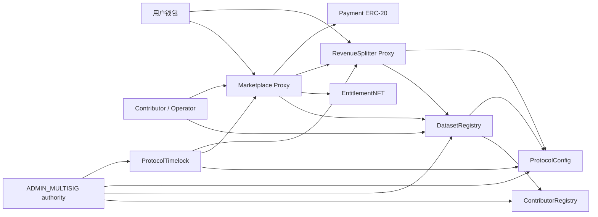
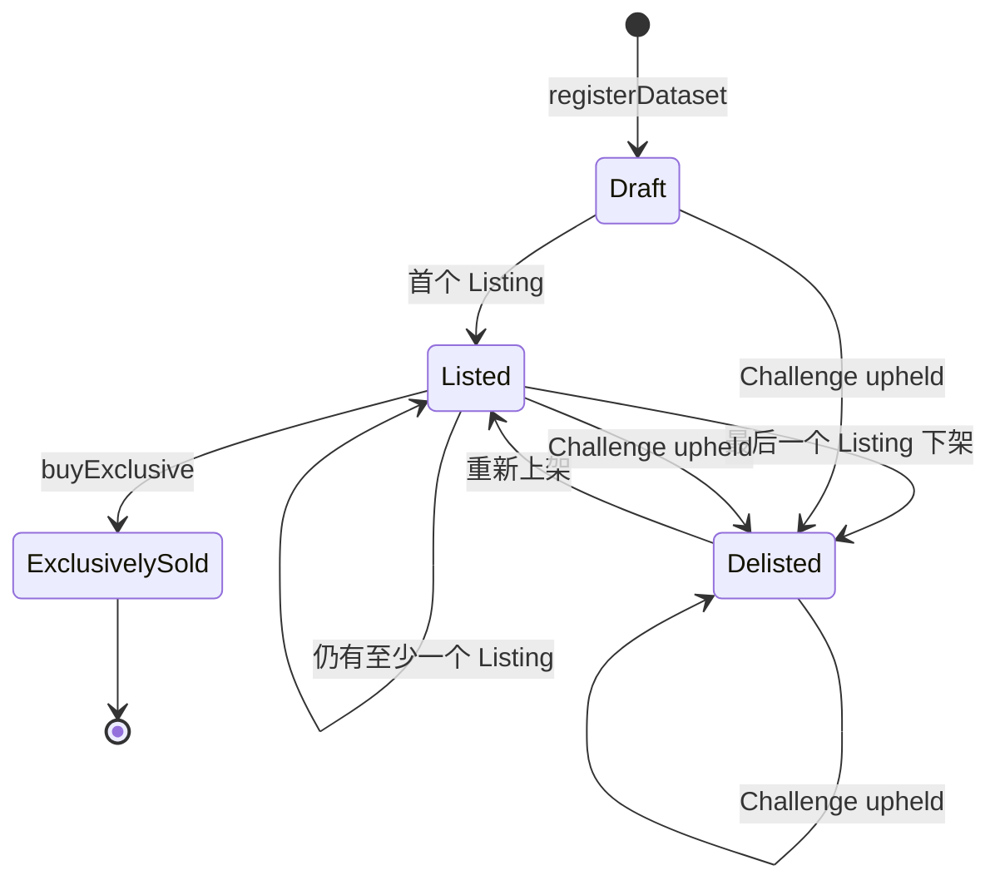

# Main Protocol V1 前端接入手册

> 面向 Web、移动端、Indexer、Gateway 和 QA 团队的当前合约接入基准。
> 文档版本：2026-08-18
> 实现基准：当前仓库 Solidity 源码与 Hardhat 编译产物
> 适用范围：Main Protocol 固定价 V1

## 1. 文档目的与优先级

本文档说明前端如何读取和调用当前 Main Protocol 合约，包括：

- 网络、地址和 ABI 的装载方式；
- Dataset 登记、固定价上架、购买、授权、收入领取和 Challenge 的完整流程；
- 枚举、结构体、金额、时间戳和 Merkle Manifest 的编码规则；
- 事件索引、缓存、链重组、交易状态和自定义错误处理；
- 普通用户、Contributor、Operator、ADMIN authority 和 Timelock 的权限边界；
- 前端单元测试、集成测试、端到端验收和上线门槛。

规则优先级如下：

1. 已部署目标网络的 chainId、链上字节码、确认区块 getter/事件和对应 ABI；
2. 经链上复核且摘要固定的部署记录；
3. 当前仓库合约源码与 `artifacts/` 编译产物；
4. `MAIN_PROTOCOL_DEVELOPMENT_SPEC.md` 中已确认的 V1 决策；
5. `protocol_technical_design.md` 原始设计。

如果前端发现这几层信息不一致，不得自行猜测，应停止该网络的写操作并由协议团队确认。

## 2. 当前 Base Sepolia 部署：接入前必须阅读

当前源码已经重新部署到 [Base Sepolia Testnet](https://chainlist.org/chain/84532)，并于 2026-08-18 通过仓库的完整链上部署验证。该部署可用于前端测试网接入，但不是生产发布。

### 2.1 网络与部署记录

| 项目              | 当前值                                                                  |
| ----------------- | ----------------------------------------------------------------------- |
| Network           | Base Sepolia Testnet                                                    |
| Chain ID          | `84532`                                                                 |
| 公共 RPC          | `https://base-sepolia-rpc.publicnode.com`                               |
| Explorer          | `https://sepolia.basescan.org`                                          |
| Deployment schema | `main-protocol-deployment-v1`                                           |
| Deployment ID     | `baseSepolia-20260818T104144000Z-45640708`                              |
| 历史记录          | `deployments/baseSepolia/baseSepolia-20260818T104144000Z-45640708.json` |
| Latest 记录       | `deployments/baseSepolia/latest.json`                                   |
| 记录区块          | `45640708`                                                              |
| 记录区块哈希      | `0x7b0136d4849bb9b940373a33edad8a60e8061c8e34a0db942929e5fdcf82ae37`    |
| Indexer 起始区块  | `45640640`                                                              |
| 部署记录 SHA-256  | `3d62705eceb13358ef009931760262eeac7406cef8645ae0da90e84f4c4b38f7`      |

`indexerStartBlock=45640640` 是通过历史区块代码查询得到的最早核心合约创建区块。Indexer 应从该区块开始回放角色、wiring、配置、升级和业务事件。

### 2.2 当前合约地址

| 合约/依赖                          | 地址                                                                                                                            |
| ---------------------------------- | ------------------------------------------------------------------------------------------------------------------------------- |
| ProtocolTimelock                   | [`0xf72460a99d18D1fb37d7ea0f0029C3706a44439E`](https://sepolia.basescan.org/address/0xf72460a99d18D1fb37d7ea0f0029C3706a44439E) |
| ContributorRegistry                | [`0xb75ec120de4A24f6691De82e67967c4aEF7b25bE`](https://sepolia.basescan.org/address/0xb75ec120de4A24f6691De82e67967c4aEF7b25bE) |
| ProtocolConfig                     | [`0x917428FaE51d94E5D2F6208f935a7636c2DD43f8`](https://sepolia.basescan.org/address/0x917428FaE51d94E5D2F6208f935a7636c2DD43f8) |
| DatasetRegistry                    | [`0x205f4951190C14c1e314C9Fe38855e836c636869`](https://sepolia.basescan.org/address/0x205f4951190C14c1e314C9Fe38855e836c636869) |
| EntitlementNFT                     | [`0x0857490D0238dd90a296EeE360b0335E43B8b3a2`](https://sepolia.basescan.org/address/0x0857490D0238dd90a296EeE360b0335E43B8b3a2) |
| RevenueSplitter Proxy              | [`0xB5A4Ee97b24deAAC5c1516Cc3f87967000d839f1`](https://sepolia.basescan.org/address/0xB5A4Ee97b24deAAC5c1516Cc3f87967000d839f1) |
| RevenueSplitter Implementation     | [`0x6893caaD4bCBd67b0D35EA75F2f3c8387C296C3e`](https://sepolia.basescan.org/address/0x6893caaD4bCBd67b0D35EA75F2f3c8387C296C3e) |
| Marketplace Proxy                  | [`0xEc0bAd0a5D9C55f3b4a4db80b62296EDC2DA0761`](https://sepolia.basescan.org/address/0xEc0bAd0a5D9C55f3b4a4db80b62296EDC2DA0761) |
| Marketplace Implementation         | [`0xA270139540e8100b75388E7414a8C906f3EeD1A2`](https://sepolia.basescan.org/address/0xA270139540e8100b75388E7414a8C906f3EeD1A2) |
| Payment Token（Base Sepolia USDC） | [`0x036CbD53842c5426634e7929541eC2318f3dCF7e`](https://sepolia.basescan.org/address/0x036CbD53842c5426634e7929541eC2318f3dCF7e) |
| ADMIN 测试账号                     | [`0x66Fa1F4C192eF29DB8fEcf8eCaF3ec0d36079C04`](https://sepolia.basescan.org/address/0x66Fa1F4C192eF29DB8fEcf8eCaF3ec0d36079C04) |
| Treasury                           | [`0x66Fa1F4C192eF29DB8fEcf8eCaF3ec0d36079C04`](https://sepolia.basescan.org/address/0x66Fa1F4C192eF29DB8fEcf8eCaF3ec0d36079C04) |
| Gateway signer                     | [`0x66Fa1F4C192eF29DB8fEcf8eCaF3ec0d36079C04`](https://sepolia.basescan.org/address/0x66Fa1F4C192eF29DB8fEcf8eCaF3ec0d36079C04) |
| Initial Nurture Contributor        | [`0x66Fa1F4C192eF29DB8fEcf8eCaF3ec0d36079C04`](https://sepolia.basescan.org/address/0x66Fa1F4C192eF29DB8fEcf8eCaF3ec0d36079C04) |
| Pipeline Operator                  | [`0x4F4a1e6dB43f9c09AaEF4D2C1C8CF079cB139E49`](https://sepolia.basescan.org/address/0x4F4a1e6dB43f9c09AaEF4D2C1C8CF079cB139E49) |

业务调用必须使用 Marketplace/RevenueSplitter 的代理地址，不能调用实现地址。

### 2.3 当前链上配置

| 配置                      | 当前链上值            |
| ------------------------- | --------------------- |
| Payment Token             | USDC，6 decimals      |
| Protocol fee              | `250 bps = 2.5%`      |
| Challenge window          | `60` 秒               |
| Protocol paused           | `false`               |
| Timelock current delay    | `60` 秒               |
| Timelock enforced minimum | `60` 秒               |
| `nextDatasetId`           | `1`，尚未登记 Dataset |
| onboarding/wiring         | 已完成并通过验证      |

当前 `ADMIN_MULTISIG` 配置地址实际是 EOA 测试账号，并非 Safe 合约；Treasury、Gateway signer 和初始 Nurture Contributor 也暂时使用该测试地址。60 秒 Challenge window 和 60 秒 Timelock 都是为了 Base Sepolia 快速验收，不代表生产参数。

### 2.4 部署记录已知差异

部署 JSON 的 `configuration.CHALLENGE_WINDOW_SECONDS` 和 `deployment.challengeWindow` 记录为 `604800`，但 ProtocolConfig 部署交易的构造参数、当前链上 `challengeWindow()` 和链上事件历史共同证明实际初始值为 `60`，且部署后没有 `ChallengeWindowUpdated`。

因此：

- 当前测试网前端必须以链上 getter 的 `60` 秒为准；
- 不得把部署 JSON 中的 `604800` 显示为当前 Challenge window；
- 动态配置始终通过 getter 和确认后的配置事件读取；
- 在部署记录生成问题修复并重新验证前，该 JSON 只能作为地址和代码哈希候选来源，不能作为所有配置字段的唯一真相。

公共 RPC 可能限流或暂时不可用，测试前端应配置备用 Base Sepolia RPC、请求超时、重试和健康检查。生产部署仍需使用真实 Safe、至少 48 小时 Timelock、正式 Gateway/Treasury、独立审计和新的生产部署记录。

## 3. V1 功能范围

### 3.1 当前支持

- Contributor 和 Pipeline Operator 白名单；
- Operator 代表一个已授权 Contributor 登记 Dataset；
- Dataset 内容、权重根和 Manifest commitment 上链；
- 注册时锁定权重；
- 注册后的公开审计窗口；
- Copy 和 Exclusive 两种固定价 Listing；
- ERC-20 精确金额支付；
- Copy 非转让授权；
- Exclusive 可转让 ERC-1155 所有权；
- 按 Dataset 隔离的 Merkle 权重收入领取；
- 管理员介导的 Challenge；
- 紧急暂停；
- Safe + Timelock 治理；
- Marketplace 和 RevenueSplitter 的 UUPS 升级。

### 3.2 当前不支持

- 拍卖、`bid`、竞价结算；
- 动态定价或议价；
- Copy 二级转让；
- 链上 KYC；
- permissionless 链上 Challenge、挑战保证金或自动裁决；
- 权重根注册后的正常更新；
- Dataset 元数据修改；
- 链上批量 Dataset 查询；
- Exclusive 二级转让手续费或协议版税；
- 原生 ETH 支付。

前端不得展示尚未实现的按钮或用词，不得把管理员介导的 Challenge 描述为“任何人可直接在链上挑战”。

## 4. 合约架构



### 4.1 七个核心合约

| 合约                  | 前端用途                                                             | 是否代理               |
| --------------------- | -------------------------------------------------------------------- | ---------------------- |
| `ContributorRegistry` | 查询角色和 Operator 归属；管理员维护白名单                           | 否                     |
| `ProtocolConfig`      | 查询支付 Token、手续费、Treasury、审计窗口、Gateway signer、暂停状态 | 否                     |
| `DatasetRegistry`     | 登记和读取 Dataset、Manifest commitment、Challenge 状态              | 否                     |
| `EntitlementNFT`      | 查询 Copy/Exclusive tokenId、余额和访问权；转移 Exclusive            | 否                     |
| `Marketplace`         | 固定价上架、下架、购买                                               | 是，前端只使用代理地址 |
| `RevenueSplitter`     | 查询收入、领取收入、触发 Treasury 提款                               | 是，前端只使用代理地址 |
| `ProtocolTimelock`    | 治理操作的 schedule、等待和 execute                                  | 否                     |

实现地址只用于区块浏览器验证和升级审计，不可作为业务调用地址。

## 5. 推荐前端技术栈与配置

本文档示例优先使用 `viem`/`wagmi`，`ethers` v6 也可以。无论使用哪套库，金额和 ID 都必须保持 `bigint`，不得先转为 JavaScript `number`。

建议的运行时配置：

```ts
export interface MainProtocolDeployment {
  deploymentId: string;
  environment: "testnet" | "production";
  testOnly: boolean;
  chainId: number;
  recordBlock: bigint;
  indexerStartBlock: bigint;
  confirmations: number;
  addresses: {
    contributorRegistry: `0x${string}`;
    protocolConfig: `0x${string}`;
    datasetRegistry: `0x${string}`;
    entitlementNFT: `0x${string}`;
    marketplaceProxy: `0x${string}`;
    marketplaceImplementation: `0x${string}`;
    revenueSplitterProxy: `0x${string}`;
    revenueSplitterImplementation: `0x${string}`;
    protocolTimelock: `0x${string}`;
    paymentToken: `0x${string}`;
    adminAuthority: `0x${string}`;
    treasury: `0x${string}`;
    gatewaySigner: `0x${string}`;
    nurtureContributor: `0x${string}`;
    pipelineOperator: `0x${string}`;
  };
  gatewayBaseUrl: string;
  manifestGatewayBaseUrl?: string;
  challengeApiBaseUrl: string;
}
```

当前 Base Sepolia 地址常量可以直接从第 2.2 节或批准后的部署文件生成。配置必须标记 `environment: "testnet"`、`testOnly: true`，并使用 `recordBlock: 45640708n`、`indexerStartBlock: 45640640n`。不要把这些地址复制到 Base Mainnet 或其他 chainId 配置中。

### 5.1 部署记录的使用方式

每次成功执行 `npm run deploy -- --network <network>` 都会生成：

```text
deployments/<network>/<deployment-id>.json
deployments/<network>/latest.json
```

记录 schema 为 `main-protocol-deployment-v1`，包含 `deploymentId`、`networkName`、`chainId`、记录区块、公开配置、全部核心/代理/实现地址、runtime code hash、外部依赖校验结果、Timelock delay 及 onboarding/wiring 状态。

前端发布时应：

1. 由协议团队确认并签署一个不可变的历史记录文件；
2. 将该文件的 `deploymentId` 和内容摘要固定到前端发布版本；
3. 把记录中的 `deployment.marketplace`、`deployment.revenueSplitter` 当作代理地址；
4. 把 `marketplaceImplementation`、`revenueSplitterImplementation` 只用于实现验证；
5. 要求 `onboardingComplete == true` 且 `wiringComplete == true`；
6. 启动时用记录中的 code hash、依赖和角色信息进行链上复核。

`latest.json` 会被下一次部署覆盖，只适合部署对账和发现候选版本，不能让已发布前端在运行时无审核地自动跟随。部署记录不包含私钥或 RPC URL，但前端仍应只发布业务必需的公开字段。

部署记录的 `blockNumber` 是记录写入时的链上高度，不保证等于七个合约中最早的部署区块。若 Indexer 要重放 wiring、角色和升级历史，协议团队必须另行给出并核验 `indexerStartBlock`；不能直接把记录区块误当成所有事件的最早高度。

当前 Base Sepolia 记录存在第 2.4 节所述 Challenge window 字段差异。前端可以使用已核验的地址、实现地址和代码哈希，但动态配置必须通过链上 getter 获取；在记录修复前不能把整个 JSON 视为原子可信配置。

### 5.2 前端依赖与目录建议

以 React/Next.js 为例，建议至少安装：

```bash
npm install viem wagmi @tanstack/react-query
```

如果使用 ethers：

```bash
npm install ethers
```

建议把协议接入与页面分离：

```text
src/protocol/
  deployments/       按 chainId 保存经过批准的部署配置
  abi/               ABI-only 文件
  clients/           public/wallet client
  reads/             Dataset、Listing、Revenue 聚合读取
  writes/            模拟和交易构建
  events/            日志解码与索引模型
  manifest/          原始字节下载、hash、schema、Merkle 验证
  errors/            自定义错误到产品文案映射
  types/             bigint 友好的领域类型
  gateway/           钱包挑战和下载授权
```

浏览器环境变量只放公开配置，例如 RPC、chainId、合约地址和 API URL。任何部署者、Admin、Gateway 或 Pipeline 私钥都不能使用 `NEXT_PUBLIC_*`、`VITE_*` 等方式进入前端包。

启动时必须校验：

1. 钱包 `chainId` 与配置一致；
2. 所有核心地址 `getCode(address) !== 0x`；
3. `ProtocolConfig.paymentToken()` 与配置一致；
4. Marketplace 代理读取到的四个依赖地址与配置一致；
5. RevenueSplitter 代理读取到的依赖地址与配置一致；
6. DatasetRegistry、EntitlementNFT、RevenueSplitter 的 `marketplace()` 都是 Marketplace 代理；
7. 各合约 `governanceTimelock()` 都指向同一 Timelock；
8. `WEIGHTS_MANIFEST_VERSION()` 和 `CHALLENGE_EVIDENCE_VERSION()` 与前端支持版本一致。
9. `ProtocolTimelock.getMinDelay()` 不低于 `enforcedMinimumDelay()`，并与部署记录一致；
10. onboarding、wiring、角色精确成员集合和代理实现地址均通过部署验收。

任意校验失败，应进入只读故障页，禁止发送交易。

## 6. ABI 与版本管理

前端应直接使用仓库根目录 `ABI/` 中经过导出和校验的 ABI-only 文件：

```text
ABI/ContributorRegistry.abi.json
ABI/ProtocolConfig.abi.json
ABI/DatasetRegistry.abi.json
ABI/EntitlementNFT.abi.json
ABI/Marketplace.abi.json
ABI/RevenueSplitter.abi.json
ABI/ProtocolTimelock.abi.json
ABI/PaymentTokenERC20.abi.json
```

`ABI/index.ts` 提供统一导出，`ABI/manifest.json` 记录 artifact 来源、ABI entry 数量和 SHA-256，`ABI/base-sepolia.addresses.json` 提供当前测试网地址映射。详细列表见 `ABI/README.md`。

这些文件通过 `npm run export:frontend-abi` 从当前 Hardhat artifact 生成。不要把包含 bytecode、metadata 和调试信息的完整 `artifacts/` 文件打包进浏览器。每次合约 ABI 变化都必须重新生成、校验清单并通知前端升级。

### 6.1 当前关键事件兼容要求

原始五参数事件必须保持不变：

```solidity
event DatasetRegistered(
  uint256 indexed datasetId,
  address indexed contributor,
  bytes32 contentHash,
  bytes32 weightsRoot,
  uint256 totalWeight
);
```

其 topic0 为：

```text
0x4365c8f547c0968e1885f791f055ae11f95e41768f24f1dfc1785398144b7828
```

当前源码的 Manifest commitment 不使用额外事件。Indexer 收到 `DatasetRegistered` 后，应通过 `weightsURI(datasetId)`、`weightsManifestHash(datasetId)` 和 `WEIGHTS_MANIFEST_VERSION()` 查询并校验 Manifest；不得使用曾经出现过的扩展版 `DatasetRegistered` ABI。

## 7. 数据类型、枚举与单位

### 7.1 枚举值

| 类型                            |  值 | 前端含义                         |
| ------------------------------- | --: | -------------------------------- |
| `DatasetStatus.Draft`           |   0 | 已登记，尚未处于挂牌状态         |
| `DatasetStatus.Listed`          |   1 | 至少一个 Listing 已激活          |
| `DatasetStatus.ExclusivelySold` |   2 | 已独家出售，终态                 |
| `DatasetStatus.Delisted`        |   3 | 当前无有效 Listing，允许重新挂牌 |
| `SaleKind.Copy`                 |   0 | Copy 授权                        |
| `SaleKind.Exclusive`            |   1 | Exclusive 所有权                 |
| `ChallengeStatus.None`          |   0 | 无 Challenge                     |
| `ChallengeStatus.Pending`       |   1 | 待裁决，购买和领取关闭           |
| `ChallengeStatus.Rejected`      |   2 | Challenge 驳回，可继续           |
| `ChallengeStatus.Upheld`        |   3 | Challenge 成功，权重永久失效     |

前端应保存数字值并在显示层映射，不要向合约传字符串。

### 7.2 Dataset

```ts
type Dataset = {
  id: bigint;
  contributor: `0x${string}`;
  contentHash: `0x${string}`;
  sampleURI: string;
  payloadURI: string;
  weightsRoot: `0x${string}`;
  totalWeight: bigint;
  status: 0 | 1 | 2 | 3;
  policy: {
    allowCopy: boolean;
    allowExclusive: boolean;
    exclusiveRequiresZeroCopies: boolean;
    licensesTransferable: boolean;
  };
  copiesSold: bigint;
  tag: string;
  createdAt: bigint;
};
```

V1 登记要求：

- `contentHash`、`weightsRoot`、`weightsManifestHash` 不能为零；
- `sampleURI`、`payloadURI`、`weightsURI` 不能为空；
- `totalWeight > 0`；
- Copy 和 Exclusive 至少允许一种；
- `licensesTransferable` 必须为 `false`；这表示 Copy 不可转让，不影响 Exclusive 的可转让性；
- Dataset 元数据、权重和销售策略登记后不可修改。

`contentHash` 是**加密后完整 payload 原始字节**的 keccak256，用于下载后的完整性校验；它不是 sample 的摘要。推荐在浏览器下载加密 payload 后先验证 `keccak256(payloadBytes) == contentHash`，再执行解密。公开 sample 位于 `sampleURI`，不要求链上 entitlement；`payloadURI` 指向受 Gateway 控制的加密完整数据。

### 7.3 Listing

```ts
type Listing = {
  datasetId: bigint;
  kind: 0 | 1;
  price: bigint;
  maxFeeBps: number;
  active: boolean;
};
```

`maxFeeBps` 在上架时自动快照当前协议费率。购买时如果当前 `feeBps` 高于该值，交易失败，保护卖家不受后续费率上调影响。

### 7.4 金额、手续费与时间

- `price`、收入和 allowance 都使用支付 Token 最小单位；
- 展示使用 `formatUnits(value, decimals)`，输入使用 `parseUnits(text, decimals)`；
- 手续费分母为 `10_000`，例如 `250` 表示 `2.5%`；
- `fee = floor(gross * feeBps / 10_000)`；
- `net = gross - fee`；
- 所有 deadline 是 Unix 秒，不是毫秒；
- 业务判断以最新区块 `timestamp` 为准，不以浏览器本地时间作为最终依据。

## 8. 页面聚合数据模型

详情页不要只依赖一个合约返回值。建议聚合如下数据：

```ts
type DatasetView = {
  dataset: Dataset;
  copyListing: Listing;
  exclusiveListing: Listing;
  weightsURI: string;
  weightsManifestHash: `0x${string}`;
  challengeWindowEndsAt: bigint;
  challengeStatus: 0 | 1 | 2 | 3;
  challengeEvidenceHash: `0x${string}`;
  challengeEvidenceURI: string;
  challengeRecordedAt: bigint;
  challengeResolutionDueAt: bigint;
  weightsInvalidated: boolean;
  protocolPaused: boolean;
  currentFeeBps: number;
  cumulativeRevenue: bigint;
  unclaimedRevenue: bigint;
  userCopyBalance?: bigint;
  userExclusiveBalance?: bigint;
  userHasAccess?: boolean;
  userClaimed?: bigint;
};
```

可使用 Multicall 在同一区块读取这些字段。缓存 key 至少包含 `chainId`、合约地址、Dataset ID 和查询区块，防止跨网络污染。

## 9. Dataset 发现与事件索引

合约没有 `getAllDatasets()`。生产前端应由 Indexer 从已核验的 `indexerStartBlock` 开始监听 `DatasetRegistered`，构建 Dataset 列表；链上读取用于详情刷新和最终校验。

临时测试环境可以读取 `nextDatasetId()`，然后遍历 `1 .. nextDatasetId - 1` 调用 `getDataset()`，但 Dataset 数量增长后不应这样做。

### 9.1 Dataset 注册事件处理

同一笔注册交易由 DatasetRegistry 发射一个 `DatasetRegistered` 业务事件。收到该事件后，Indexer 必须在对应确认区块读取 Manifest 三个 getter，补全 URI、摘要和版本。

Indexer 应记录 `transactionHash`、`blockNumber`、`blockHash`、`logIndex`，并以 `(chainId, transactionHash, logIndex)` 幂等入库。合并键是 `(chainId, DatasetRegistry, datasetId)`。

### 9.2 最终性和链重组

- 新事件先标为 `pending`；
- 达到部署配置要求的确认数后标为 `confirmed`；
- 发现同高度 block hash 变化时，回滚受影响日志并重放；
- UI 在未确认阶段显示“链上确认中”；
- 写交易完成后先用 receipt 更新局部状态，再由确认后的 Indexer 数据收敛。

## 10. 角色与身份

角色常量均从合约读取，不建议在前端手写哈希：

- `ADMIN_ROLE()`；
- `OPERATOR_ROLE()`；
- `CONTRIBUTOR_ROLE()`；
- `DEFAULT_ADMIN_ROLE()`。

### 10.1 登记身份判断

调用 `registerDataset` 的地址必须满足以下之一：

1. 自身持有 `CONTRIBUTOR_ROLE`，Dataset contributor 记为调用者；
2. 持有 `OPERATOR_ROLE`，且 `operatorContributor(caller)` 指向一个仍持有 `CONTRIBUTOR_ROLE` 的地址，Dataset contributor 记为该地址。

前端在展示登记表单前应读取角色和映射，但仍需处理交易执行前角色被撤销的情况。

### 10.2 ADMIN authority

生产部署的 `ADMIN_ROLE` 必须授予 Safe 合约地址，而不是某个 Safe owner EOA。一个 owner 钱包直接调用受 `ADMIN_ROLE` 保护的函数会失败；生产 Admin 控制台应生成 Safe Transaction，或接入 Safe SDK，由达到阈值的 owner 签名并通过 Safe 执行。

当前 Base Sepolia 部署显式启用了测试例外，`ADMIN_MULTISIG` 实际是 EOA，可由该测试账号直接发起 ADMIN 和 Timelock 交易。前端必须按链上 `getCode(adminAddress)` 区分 EOA/合约模式，并在 EOA 模式显示“仅限测试、无多签保护”，不能强制走 Safe SDK。

## 11. Dataset 登记流程

登记函数：

```solidity
registerDataset(RegisterParams p) returns (uint256 datasetId)
```

参数顺序必须与 ABI 一致：

```ts
type RegisterParams = {
  expectedDatasetId: bigint;
  contentHash: `0x${string}`;
  sampleURI: string;
  payloadURI: string;
  weightsRoot: `0x${string}`;
  totalWeight: bigint;
  weightsURI: string;
  weightsManifestHash: `0x${string}`;
  policy: {
    allowCopy: boolean;
    allowExclusive: boolean;
    exclusiveRequiresZeroCopies: boolean;
    licensesTransferable: false;
  };
  tag: string;
};
```

### 11.1 推荐步骤

1. 检查 `ProtocolConfig.paused() == false`；
2. 检查 DatasetRegistry 已 wiring 到 Marketplace；
3. 检查调用者角色和 Operator 归属；
4. 生成并本地验证 weights manifest；
5. 上传 sample、加密 payload 和 manifest，取得 URI；
6. 对 manifest 的原始响应字节计算 `keccak256`；
7. 读取 `nextDatasetId()` 作为 `expectedDatasetId`；
8. 立即在同一流程内模拟 `registerDataset`；
9. 请求钱包或 Safe 签名；
10. 等待 receipt，解析五参数 `DatasetRegistered`；
11. 用 receipt 中的 `datasetId` 作为最终 ID，不要只相信提交前读取值；
12. 重新读取 Dataset、Manifest commitment 和挑战窗口截止时间。

`expectedDatasetId` 是并发保护。如果另一个注册先成交，合约会抛出 `UnexpectedDatasetId(expected, actual)`；前端应重新读取 ID、重新绑定 manifest 并重新签名，不能自动把旧 manifest 提交给新 ID。

### 11.2 审计窗口

每个 Dataset 的 `challengeWindowEndsAt` 在注册时按当时的 `ProtocolConfig.challengeWindow` 快照。之后治理修改全局窗口只影响未来注册。

审计窗口内允许创建 Listing，但购买和领取收入仍关闭。在 `block.timestamp == challengeWindowEndsAt` 时窗口视为结束。

## 12. Listing 与 Dataset 状态机

### 12.1 上架接口

```solidity
listCopy(uint256 datasetId, uint256 price)
listExclusiveFixed(uint256 datasetId, uint256 price)
delist(uint256 datasetId, SaleKind kind)
```

只有 `Dataset.contributor` 本人可以上架或下架。即使 Dataset 是由 Operator 代为登记，Operator 也不是链上卖家，除非 Operator 地址本身就是该 Dataset 的 contributor。

上架前端检查：

- 协议未暂停；
- 当前钱包等于 `dataset.contributor`；
- `price > 0`；
- 对应 `policy.allowCopy` 或 `policy.allowExclusive` 为真；
- 同类型 Listing 未激活；
- Dataset 不是 `ExclusivelySold`；
- `weightsInvalidated == false`；
- Challenge 不是 `Pending` 或 `Upheld`；
- Exclusive 且 `exclusiveRequiresZeroCopies == true` 时，`copiesSold == 0`。

上架成功时 Listing 的 `maxFeeBps` 自动记录当前 `feeBps`。前端不能指定该值。

### 12.2 下架规则

- 下架在协议暂停时仍可执行；
- 下架一个类型不会影响另一个仍激活的 Listing；
- 当最后一个激活 Listing 被关闭时，Dataset 从 `Listed` 变为 `Delisted`；
- `Delisted` 可重新上架，但权重已失效或已独家售出的 Dataset 不可重新上架；
- Challenge 为 `Pending` 时可以主动下架，但不能新建或重新上架。

### 12.3 状态图



前端的“可购买”不能只根据 `DatasetStatus.Listed` 判断，还必须综合 Listing、暂停、审计窗口、Challenge、权重失效和用户余额。

## 13. Copy 购买流程

接口：

```solidity
buyCopy(uint256 datasetId, uint256 expectedPrice, uint256 deadline)
```

### 13.1 购买条件

- Copy Listing 激活；
- Dataset 状态为 `Listed`；
- 当前区块时间已经到达审计窗口截止时间；
- Challenge 是 `None` 或 `Rejected`；
- 权重没有失效；
- 协议未暂停；
- 当前价格等于用户确认的 `expectedPrice`；
- 当前协议费不高于 Listing 的 `maxFeeBps`；
- `block.timestamp <= deadline`；
- 买家尚未持有该 Dataset 的 Copy token。

Copy 数量对不同钱包不设总量上限，但同一钱包不能重复购买同一 Copy。

### 13.2 Approve 与购买

支付 Token 的 spender 必须是 **Marketplace 代理地址**，不是 RevenueSplitter。

推荐交互：

1. 读取支付 Token `decimals`、买家余额和 `allowance(buyer, marketplaceProxy)`；
2. 重新读取 `getListing(datasetId, Copy)`；
3. 如果 allowance 不足，调用 ERC-20 `approve(marketplaceProxy, amount)`；
4. 等待 approve receipt；
5. 设置有限 deadline，例如最新区块时间加 10 分钟；
6. 用当前 Listing price 作为 `expectedPrice` 模拟 `buyCopy`；
7. 发送购买交易并等待 receipt；
8. 解析 `TransferSingle`、`RevenueAccrued`、可能的 `ListingDelisted` 和 `CopyPurchased`；
9. 重新读取 Listing、Dataset、余额和访问权。

不建议默认无限授权。若产品允许无限授权，必须明确展示风险，并提供撤销入口。

### 13.3 交易内效果

成功购买会：

- 从买家向 RevenueSplitter 精确转入 `price`；
- 记录手续费和 Dataset 净收入；
- 给买家铸造 1 个不可转让 Copy ERC-1155；
- `copiesSold += 1`；
- 如果策略要求 Exclusive 前零 Copy，则关闭活跃的 Exclusive Listing；
- 发射 `CopyPurchased`。

支付 Token 必须是 exact-transfer ERC-20。fee-on-transfer、rebase、黑名单或非标准余额行为可能导致交易失败，不应在 UI 中承诺兼容。

## 14. Exclusive 购买流程

接口：

```solidity
buyExclusive(uint256 datasetId, uint256 expectedPrice, uint256 deadline)
```

前置条件与 Copy 基本相同，另外：

- Exclusive Listing 必须激活；
- `policy.allowExclusive == true`；
- 如果 `exclusiveRequiresZeroCopies == true`，则 `copiesSold == 0`。

成功后：

- Dataset 进入终态 `ExclusivelySold`；
- Copy 和 Exclusive 两个 Listing 都关闭；
- 买家获得唯一的 1 个 Exclusive ERC-1155；
- 不能再新增任何 Copy 或 Exclusive 销售。

Exclusive token 可使用标准 ERC-1155 `safeTransferFrom` 转让。转让后新持有人获得 `hasAccess`，旧持有人失去访问权；二级转让不会给协议或 Contributor 产生收入。

需要对买家明确披露：链上 Exclusive 只能阻止后续链上销售和 Gateway 后续交付，无法从已经下载数据的历史 Copy 买家设备中删除字节。

## 15. Entitlement 与 Gateway 接入

### 15.1 Token ID

不要在前端自行拼接字符串生成 ID。优先调用：

```solidity
tokenId(uint256 datasetId, SaleKind kind) returns (uint256)
```

固定公式为：

```solidity
uint256(keccak256(abi.encode(datasetId, kind)))
```

### 15.2 访问权

使用：

```solidity
hasAccess(uint256 datasetId, address who) returns (bool)
```

规则：

- 未独家售出时，Copy 或 Exclusive 余额大于零都视为有权访问；
- 独家售出后，只有当前 Exclusive 持有人有权访问；
- 未知 Dataset 或零地址返回 `false`。

在 Exclusive 售出后，历史 Copy 持有人即使仍持有不可转让 token，`hasAccess` 也会返回 false。Gateway 必须与此规则一致，停止为其签发新的下载权限。

### 15.3 推荐 Gateway 授权协议

链下 Gateway 不在本仓库合约范围内，但前端至少需要以下流程：

1. 请求 Gateway 生成包含 `chainId`、Dataset ID、钱包、nonce、过期时间和用途的登录消息；
2. 用户用当前钱包签名，避免复用永久签名；
3. Gateway 校验签名、nonce、过期时间和目标域；
4. Gateway 在最新确认区块调用 `hasAccess(datasetId, wallet)`；
5. 校验通过后返回短期下载 URL 或解密密钥封装；
6. 返回内容由 `ProtocolConfig.gatewaySigner()` 对响应摘要签名；
7. 前端可验证 signer，并展示过期时间。

Gateway 不得仅相信前端传来的 `hasAccess=true`，也不得仅凭历史购买事件授权。Exclusive 转让和 Challenge 都可能改变当前访问结果。

V1 的数据交付采用 envelope encryption：

1. Pipeline 用随机 data key 加密一次完整 payload；
2. 加密 payload 存储在 `payloadURI`，其摘要记录为 `contentHash`；
3. 买家通过钱包挑战向 Gateway 认证；
4. Gateway 链上校验 `hasAccess`；
5. Gateway 将 data key 重新加密给买家的公钥；
6. 前端验证 payload 摘要，并在客户端解密。

私有 data key、Gateway 私钥和 payload 明文不能返回到日志、分析平台或错误监控。未来的 MPC/TEE 密钥托管不属于当前合约接口，前端不能假设已经实现。

## 16. Weights Manifest 与收入 Claim

### 16.1 Manifest 是领取所必需的数据

链上 `weightsRoot` 只能验证 proof，无法告诉用户自己的 weight 和 proof。前端必须能够从 `weightsURI(datasetId)` 独立发现并验证 Manifest，不得要求用户人工联系运营方。

当前 schema：

```text
main-protocol.weights-manifest.v1
```

Manifest 必须包含且只包含：

```ts
type WeightsManifestV1 = {
  schema: "main-protocol.weights-manifest.v1";
  datasetId: string;
  chainId: string;
  datasetRegistry: string;
  leafEncoding: "keccak256(abi.encode(address,uint256))";
  pairHashing: "sorted-keccak256;promote-unpaired";
  totalWeight: string;
  weightsRoot: `0x${string}`;
  entries: Array<{
    address: `0x${string}`;
    weight: string;
    proof: `0x${string}`[];
  }>;
  pipeline: {
    version: string;
    generatedAt: string;
    contentDigest: `0x${string}`;
  };
};
```

大整数使用十进制字符串。权威生成器输出 checksum 地址；验证时按地址大小写不敏感地检查唯一性。每个地址必须非零，每个 weight 为正数且不超过 totalWeight，所有 weight 之和必须恰好等于 totalWeight。

### 16.2 Manifest 下载与验证顺序

1. 从链上读取 `weightsURI`、`weightsManifestHash`、`WEIGHTS_MANIFEST_VERSION`；
2. 把 `ipfs://CID/path` 映射到受信 IPFS gateway；`ar://id` 映射到 Arweave；生产浏览器不支持 `file://`；
3. 读取**原始响应字节**；
4. 计算 `keccak256(rawBytes)`，必须等于链上 `weightsManifestHash`；
5. 解析 JSON，并拒绝未知字段；
6. 校验 schema、Dataset ID、chain ID、DatasetRegistry 地址；
7. 校验 totalWeight 和 weightsRoot 等于链上 Dataset；
8. 校验 leaf encoding、pair hashing；
9. 校验地址唯一、weight 正数、总和完全相等；
10. 按规范重建整棵树并校验 root；
11. 校验 Manifest 内每个 proof；
12. 按连接钱包的 checksum 地址查找 entry。

注意：不要对解析后重新 `JSON.stringify` 的内容计算 commitment。空格、键顺序或换行变化都会改变原始字节哈希。应先验证原始字节哈希，再解析。

如果 Manifest 不可用、哈希不匹配、绑定错误或 proof 错误，必须禁止 Claim，显示可诊断错误，并提供 Challenge 入口。

### 16.3 Merkle 规则

- Leaf：`keccak256(abi.encode(address, uint256))`，不是 `abi.encodePacked`；
- 每层先对节点字节值排序，再 `keccak256(concat(left, right))`；
- 奇数个节点时，最后一个节点原样提升到下一层；
- 所有初始 leaf hash 按确定性规则构树；
- Claim 的 `msg.sender` 必须与 leaf 地址一致，不能由另一个钱包代领。

浏览器端可以复用协议发布的 verifier 包；不建议各前端团队独立重写算法。仓库的权威实现是 `scripts/lib/weights-manifest.ts` 与 `scripts/lib/merkle-allocation.ts`。

### 16.4 Claim 数据与公式

读取：

```solidity
cumulativeRevenue(uint256 datasetId) returns (uint256)
unclaimedRevenue(uint256 datasetId) returns (uint256)
claimed(uint256 datasetId, address who) returns (uint256)
claimable(uint256 datasetId, address who, uint256 weight) returns (uint256)
```

公式：

```text
entitled = floor(weight * cumulativeRevenue[datasetId] / totalWeight)
owed = entitled - claimed[datasetId][wallet]
```

`claimable` 只是数学预览，不接收 proof，因此不能证明用户真的在树中。前端必须先验证 Manifest 和 proof，最终以 `claim` 模拟结果为准。

写入：

```solidity
claim(uint256 datasetId, uint256 weight, bytes32[] proof)
```

Claim 条件：

- 协议未暂停；
- 审计窗口已结束；
- Challenge 为 `None` 或 `Rejected`；
- 权重未失效；
- Manifest 和 proof 有效；
- `weight <= totalWeight`；
- `owed > 0`；
- `owed <= unclaimedRevenue[datasetId]`。

收入按 Dataset 隔离，一个 Dataset 无法领取另一个 Dataset 的未领取收入。新的销售发生后 `cumulativeRevenue` 增加，用户可以再次 Claim 差额。

整数除法可能产生 rounding dust。V1 没有把该 dust 提给 Treasury 或 Admin 的入口；后续收入可能使其中一部分变为可领取，最终残余保留在 RevenueSplitter。

## 17. Challenge 接入

### 17.1 准确产品描述

V1 是“公开链下提交、管理员链上记录与裁决”：

- 任何人可通过公开 API 提交证据；
- 只有持有 `ADMIN_ROLE` 的 ADMIN authority 可调用 `recordChallenge`；
- 只有 ADMIN authority 可调用 `resolveChallenge`；
- 合约不自动验证争议事实，也没有 bond、奖励或惩罚。

### 17.2 用户提交

公开入口约定：

```http
POST /v1/datasets/{datasetId}/challenges
Content-Type: application/json
```

证据必须符合 `schemas/weight-challenge-evidence-v1.schema.json`，并唯一绑定 chain、Registry、Dataset 和被挑战的 weightsRoot。API 应返回 submission ID、原始证据摘要、收到时间和状态查询地址。

运营要求：

- 合法且可读取的提交在 24 小时内确认；
- 必须在 Dataset 挑战窗口关闭前调用链上 `recordChallenge`；
- 临近截止时间的提交立即告警；
- 链上 Pending 后的裁决 SLA 为 72 小时；
- Pending 不自动过期，超时仍保持阻断并公开 SLA 违约。

### 17.3 Admin 链上操作

```solidity
recordChallenge(uint256 datasetId, bytes32 evidenceHash, string evidenceURI)
resolveChallenge(uint256 datasetId, bool upheld)
```

`recordChallenge` 只能在 `block.timestamp < challengeWindowEndsAt` 时调用；只允许从 `None` 或 `Rejected` 进入 `Pending`。原始证据字节的 `keccak256` 必须等于 `evidenceHash`。

`resolveChallenge(false)` 进入 `Rejected`。原始挑战窗口结束后，购买和 Claim 恢复。

`resolveChallenge(true)` 进入 `Upheld`，永久失效权重、关闭两个 Listing，并将 Dataset 设为 `Delisted`。修复方式只能是登记新 Dataset；旧收入不迁移，旧 ID 不能恢复。

### 17.4 前端状态展示

| 状态             | 显示               | 购买     | Claim    | 上架     | 下架           |
| ---------------- | ------------------ | -------- | -------- | -------- | -------------- |
| None，窗口内     | 审计中             | 禁止     | 禁止     | 允许     | 允许           |
| None，窗口后     | 可用               | 允许     | 允许     | 允许     | 允许           |
| Pending          | 争议待裁决         | 禁止     | 禁止     | 禁止     | 允许           |
| Rejected，窗口内 | 争议驳回，仍审计中 | 禁止     | 禁止     | 允许     | 允许           |
| Rejected，窗口后 | 可用               | 允许     | 允许     | 允许     | 允许           |
| Upheld           | 权重失效           | 永久禁止 | 永久禁止 | 永久禁止 | 无活跃 Listing |

## 18. Pause 行为

`ProtocolConfig.paused()` 是全局紧急状态。暂停时：

| 操作                     | 是否允许       |
| ------------------------ | -------------- |
| 链上读取                 | 允许           |
| Dataset 登记             | 禁止           |
| 上架/重新上架            | 禁止           |
| 购买                     | 禁止           |
| Claim                    | 禁止           |
| Contributor 主动下架     | 允许           |
| record/resolve Challenge | 允许           |
| withdrawTreasury         | 允许           |
| Timelock 治理执行        | 按目标函数规则 |
| Admin unpause            | 允许           |

前端应全局订阅 `Paused`/`Unpaused`，并在每次写入前重新读取状态。暂停横幅不能阻止用户查看已有授权、收入、证据和交易历史。

## 19. Governance、Safe 与 Timelock

### 19.1 权限分层

- 当前协议拓扑只有一个 `ADMIN_MULTISIG` authority：它直接持有运营 `ADMIN_ROLE`，负责 Contributor/Operator、Operator attribution、暂停/恢复、Challenge 和一次性 wiring；
- 同一个 `ADMIN_MULTISIG` 也是 ProtocolTimelock 的唯一 proposer、executor 和 canceller，通过 Timelock 间接发起治理操作；
- ProtocolTimelock 自身是永久唯一的 `DEFAULT_ADMIN_ROLE` 持有人，负责延迟执行手续费、Treasury、审计窗口、Gateway signer、UUPS 升级、token rescue 和治理角色变更；
- 普通 EOA：购买、领取、触发 Treasury 提款；具备 Contributor 身份时可登记和管理自己的 Listing。

“运营路径”和“治理路径”是权限路径的区分，不代表存在两个不同管理地址。生产时该 authority 必须是 Safe；当前 Base Sepolia 快速验收部署中它是 EOA。前端必须从部署记录和链上角色读取唯一 `adminMultisig`，不得自行配置第二个 Governance Safe。

### 19.2 Timelock 流程

配置或升级不能由 Safe 直接调用目标合约。标准步骤：

1. 编码目标合约 calldata；
2. 计算或指定 `predecessor`，无依赖时为零哈希；
3. 生成唯一 `salt`；
4. 调用 `hashOperation(target, value, data, predecessor, salt)`；
5. `ADMIN_MULTISIG` authority 调用 `schedule(..., delay)`；生产由 Safe 执行，当前 Base Sepolia 测试由 EOA 执行；
6. 等待 `getTimestamp(operationId)` 到达且状态 Ready；
7. 调用 `execute(...)`；
8. 校验目标合约事件与新状态。

生产模式的初始 delay 不得低于 48 小时，且部署后不得降到该部署的 `enforcedMinimumDelay` 以下。只有同时满足“Base Sepolia、`ALLOW_EOA_ADMIN_ON_BASE_SEPOLIA_TEST=true`、测试管理员为 EOA”时，部署工具才允许显式短延迟测试模式；其初始 delay 不得低于 60 秒且必须小于 48 小时。该模式只能用于无真实资金的临时验收，前端必须显示醒目的“测试治理延迟”警告，不能把它作为生产安全承诺。

Admin 前端应展示 operation ID、目标、calldata 解码、predecessor、salt、当前 `getMinDelay`、不可降低的 `enforcedMinimumDelay`、计划时间、当前状态和执行交易，不得只展示原始十六进制。

Timelock 关键事件：`CallScheduled`、`CallExecuted`、`Cancelled`、`MinDelayChange`、`CallSalt`。

## 20. 合约读取接口清单

### 20.1 ContributorRegistry

| 函数                                        | 用途                            |
| ------------------------------------------- | ------------------------------- |
| `hasRole(role, account)`                    | 判断角色                        |
| `getRoleMemberCount(role)`                  | 角色成员数量                    |
| `getRoleMember(role, index)`                | 枚举角色成员                    |
| `getRoleMembers(role)`                      | 一次读取角色成员                |
| `operatorContributor(operator)`             | Operator 当前代表的 Contributor |
| `ADMIN_ROLE/OPERATOR_ROLE/CONTRIBUTOR_ROLE` | 获取角色常量                    |

### 20.2 ProtocolConfig

| 函数                | 用途                    |
| ------------------- | ----------------------- |
| `paymentToken()`    | ERC-20 地址，不可变     |
| `feeBps()`          | 当前费率                |
| `treasury()`        | Treasury 接收地址       |
| `challengeWindow()` | 未来 Dataset 的审计窗口 |
| `gatewaySigner()`   | Gateway 响应 signer     |
| `paused()`          | 全局暂停状态            |
| `MAX_FEE_BPS()`     | 10,000                  |

### 20.3 DatasetRegistry

| 函数                            | 用途                              |
| ------------------------------- | --------------------------------- |
| `nextDatasetId()`               | 下一个登记 ID                     |
| `getDataset(id)`                | Dataset 全结构；未知 ID 会 revert |
| `weightsURI(id)`                | Manifest URI                      |
| `weightsManifestHash(id)`       | Manifest 原始字节摘要             |
| `WEIGHTS_MANIFEST_VERSION()`    | Manifest 版本 commitment          |
| `challengeWindowEndsAt(id)`     | 该 Dataset 的固定截止时间         |
| `challengeStatus(id)`           | Challenge 枚举                    |
| `challengeEvidenceHash/URI(id)` | 当前证据 commitment               |
| `challengeRecordedAt(id)`       | 当前 Pending 记录时间             |
| `challengeResolutionDueAt(id)`  | 裁决 SLA 截止时间                 |
| `weightsInvalidated(id)`        | 是否永久失效                      |

公开 mapping getter 对未知 ID 可能返回默认值；只有 `getDataset` 可用于判断 Dataset 是否存在。

### 20.4 Marketplace

| 函数                   | 用途                     |
| ---------------------- | ------------------------ |
| `getListing(id, kind)` | Listing 全结构           |
| `priceOf(id, kind)`    | 激活时返回 price，否则 0 |

未知或从未创建的 Listing 会被标准化为指定 ID/kind、price 0、maxFeeBps 0、active false。

### 20.5 EntitlementNFT

| 函数                                  | 用途                  |
| ------------------------------------- | --------------------- |
| `tokenId(id, kind)`                   | 计算协议 token ID     |
| `balanceOf(account, tokenId)`         | ERC-1155 余额         |
| `balanceOfBatch(accounts, ids)`       | 批量余额              |
| `hasAccess(id, account)`              | 当前 Gateway 访问判断 |
| `exclusiveMinted(id)`                 | Exclusive 是否曾铸造  |
| `isApprovedForAll(account, operator)` | ERC-1155 操作授权     |

### 20.6 RevenueSplitter

| 函数                             | 用途                                 |
| -------------------------------- | ------------------------------------ |
| `cumulativeRevenue(id)`          | Dataset 累计净收入                   |
| `unclaimedRevenue(id)`           | Dataset 尚未领取净收入               |
| `claimed(id, account)`           | 用户累计已领取权利值                 |
| `claimable(id, account, weight)` | 无 proof 的数学预览                  |
| `treasuryBalance()`              | Treasury 已记录待提余额              |
| `contributorBalance()`           | 所有 Dataset 的 Contributor 负债总额 |

### 20.7 ProtocolTimelock

| 函数                                         | 用途                         |
| -------------------------------------------- | ---------------------------- |
| `getMinDelay()`                              | 当前治理延迟，可通过治理增加 |
| `enforcedMinimumDelay()`                     | 本次部署不可突破的最低延迟   |
| `PROTOCOL_MIN_DELAY()`                       | 生产基准 48 小时             |
| `TEST_MIN_DELAY()`                           | 显式测试模式最低 60 秒       |
| `hashOperation(...)`                         | 计算单操作 ID                |
| `getTimestamp(operationId)`                  | 读取计划时间或完成状态标记   |
| `getOperationState(operationId)`             | 读取 OpenZeppelin 操作状态   |
| `isOperationPending/Ready/Done(operationId)` | 便捷状态判断                 |
| `PROPOSER_ROLE/EXECUTOR_ROLE/CANCELLER_ROLE` | 核对 ADMIN_MULTISIG 治理角色 |

生产前端必须验证 `enforcedMinimumDelay >= PROTOCOL_MIN_DELAY`。Base Sepolia 临时 EOA 测试部署可以低于该值，但必须由部署记录明确配置测试例外，且不能被误标为生产。

## 21. 写入接口与调用者清单

| 合约/函数                                                                  | 合法调用者                             |
| -------------------------------------------------------------------------- | -------------------------------------- |
| `DatasetRegistry.registerDataset`                                          | Contributor 或已映射 Operator          |
| `Marketplace.listCopy/listExclusiveFixed/delist`                           | Dataset contributor                    |
| `Marketplace.buyCopy/buyExclusive`                                         | 任意满足条件的买家                     |
| `RevenueSplitter.claim`                                                    | Manifest leaf 对应钱包本人             |
| `RevenueSplitter.withdrawTreasury`                                         | 任意地址可触发，款项只发送到 Treasury  |
| `EntitlementNFT.safeTransferFrom`                                          | Exclusive 持有人或其 ERC-1155 operator |
| `ContributorRegistry.setOperatorContributor`                               | ADMIN authority                        |
| `DatasetRegistry.recordChallenge/resolveChallenge`                         | ADMIN authority                        |
| `ProtocolConfig.pause/unpause`                                             | ADMIN authority                        |
| `ProtocolConfig.setFeeBps/setTreasury/setChallengeWindow/setGatewaySigner` | Timelock                               |
| `Marketplace/RevenueSplitter.upgradeToAndCall`                             | Timelock                               |
| `RevenueSplitter.rescueToken`                                              | Timelock                               |

## 22. 业务事件清单与索引建议

| 合约                        | 事件                           | Indexer 动作                     |
| --------------------------- | ------------------------------ | -------------------------------- |
| ContributorRegistry         | `OperatorContributorUpdated`   | 更新 Operator attribution        |
| DatasetRegistry             | `DatasetRegistered`            | 新建 Dataset 基础记录            |
| DatasetRegistry             | `WeightChallengePending`       | 标记 Pending 和 due time         |
| DatasetRegistry             | `WeightChallengeResolved`      | 标记 Rejected/Upheld，并链上回读 |
| Marketplace                 | `CopyListed`                   | 激活 Copy Listing                |
| Marketplace                 | `ExclusiveListed`              | 激活 Exclusive Listing           |
| Marketplace                 | `ListingDelisted`              | 关闭对应 Listing                 |
| Marketplace                 | `CopyPurchased`                | 创建 Copy 购买记录               |
| Marketplace                 | `ExclusivePurchased`           | 创建 Exclusive 购买记录          |
| RevenueSplitter             | `RevenueAccrued`               | 记录 gross/fee/net               |
| RevenueSplitter             | `RevenueClaimed`               | 记录领取                         |
| RevenueSplitter             | `TreasuryWithdrawn`            | 记录 Treasury 提款               |
| RevenueSplitter             | `TokenRescued`                 | 治理安全审计记录                 |
| EntitlementNFT              | `TransferSingle/TransferBatch` | 更新 ERC-1155 所有人和余额       |
| ProtocolConfig              | 配置更新、`Paused/Unpaused`    | 刷新全局配置                     |
| Marketplace/RevenueSplitter | `Upgraded`                     | 切换 ABI 风险告警和版本审计      |

### 22.1 不应只靠单个事件推导的状态

- `WeightChallengeResolved` 只有 `upheld`，Indexer 仍应回读 Challenge 状态和权重失效状态；
- `ListingDelisted` 可能来自用户下架、Copy 自动关闭 Exclusive、Exclusive 购买或 Challenge upheld；
- ERC-1155 `TransferSingle` 的 mint 只说明 token 变化，不代替购买事件；
- 配置事件说明变化，但页面最终值以确认区块的 getter 为准；
- 升级后必须按部署治理记录切换到被批准的新 ABI，不能自动信任未知实现。

### 22.2 主要交易的事件顺序

Copy 购买通常包含：

1. ERC-20 `Transfer(buyer, RevenueSplitter, price)`；
2. `RevenueAccrued`；
3. ERC-1155 `TransferSingle(0x0, buyer, copyTokenId, 1)`；
4. 可选 `ListingDelisted(datasetId, Exclusive)`；
5. `CopyPurchased`。

Exclusive 购买通常包含：

1. ERC-20 `Transfer`；
2. `RevenueAccrued`；
3. 一个或两个 `ListingDelisted`；
4. ERC-1155 `TransferSingle`；
5. `ExclusivePurchased`。

不要依赖日志绝对位置做业务判断，应按合约地址和 event signature 解码。

### 22.3 当前业务事件 ABI

以下声明可用于核对 Indexer schema；实际解码仍应使用发布 ABI：

```solidity
// ContributorRegistry
event OperatorContributorUpdated(
  address indexed operator,
  address indexed previousContributor,
  address indexed newContributor
);

// DatasetRegistry
event DatasetRegistered(
  uint256 indexed datasetId,
  address indexed contributor,
  bytes32 contentHash,
  bytes32 weightsRoot,
  uint256 totalWeight
);
event WeightChallengePending(
  uint256 indexed datasetId,
  bytes32 indexed evidenceHash,
  string evidenceURI,
  bytes32 evidenceVersion,
  uint256 resolutionDueAt
);
event WeightChallengeResolved(uint256 indexed datasetId, bool upheld);

// Marketplace
event CopyListed(uint256 indexed datasetId, uint256 price, uint16 maxFeeBps);
event ExclusiveListed(uint256 indexed datasetId, uint256 price, uint16 maxFeeBps);
event ListingDelisted(uint256 indexed datasetId, SaleKind kind);
event CopyPurchased(uint256 indexed datasetId, address indexed buyer, uint256 price);
event ExclusivePurchased(uint256 indexed datasetId, address indexed buyer, uint256 price);

// RevenueSplitter
event RevenueAccrued(uint256 indexed datasetId, uint256 gross, uint256 fee, uint256 net);
event RevenueClaimed(uint256 indexed datasetId, address indexed subContributor, uint256 amount);
event TreasuryWithdrawn(address indexed treasury, uint256 amount);
event TokenRescued(address indexed token, address indexed recipient, uint256 amount);

// ProtocolConfig
event FeeBpsUpdated(uint16 previousFeeBps, uint16 newFeeBps);
event TreasuryUpdated(address indexed previousTreasury, address indexed newTreasury);
event ChallengeWindowUpdated(uint64 previousWindow, uint64 newWindow);
event GatewaySignerUpdated(address indexed previousSigner, address indexed newSigner);
event Paused(address account);
event Unpaused(address account);
```

此外还要处理 AccessControl 的 `RoleGranted/RoleRevoked`、ERC-1155 的 `TransferSingle/TransferBatch/ApprovalForAll`、UUPS 的 `Upgraded` 及 Timelock 事件。一次性 `MarketplaceWired` 主要用于部署验收。

## 23. 自定义错误与中文提示

前端必须解析 revert data。viem 可使用 ABI 解码 contract error；ethers v6 可使用 `Interface.parseError(data)`。无法解码时保留交易 hash、chainId 和原始 selector 供排障，但不要向普通用户直接展示长十六进制。

### 23.1 通用与权限

| 错误                                              | 建议提示/处理                  |
| ------------------------------------------------- | ------------------------------ |
| `AccessControlUnauthorizedAccount(account, role)` | 当前账户没有执行此操作的角色   |
| `OnlyGovernanceTimelock(caller)`                  | 此操作必须经治理 Timelock 执行 |
| `GovernanceRoleLocked(account)`                   | 固定治理角色不能按当前方式变更 |
| `ZeroAddress()`                                   | 参数中包含零地址；检查配置     |
| `ProtocolPaused()` / `EnforcedPause()`            | 协议已暂停，请稍后重试         |

### 23.2 Dataset 登记与状态

| 错误                                                               | 建议提示/处理                                          |
| ------------------------------------------------------------------ | ------------------------------------------------------ |
| `UnauthorizedRegistrar(caller)`                                    | 当前钱包不是 Contributor，也不是已映射 Operator        |
| `UnexpectedDatasetId(expected, actual)`                            | Dataset ID 已变化；重新生成并发布绑定新 ID 的 Manifest |
| `DatasetNotFound(id)`                                              | Dataset 不存在                                         |
| `MarketplaceNotWired()`                                            | 部署未完成，禁止接入                                   |
| `InvalidContentHash/InvalidWeightsRoot/InvalidWeightsManifestHash` | 对应摘要无效                                           |
| `EmptySampleURI/EmptyPayloadURI/EmptyWeightsURI`                   | 对应 URI 不能为空                                      |
| `InvalidTotalWeight()`                                             | totalWeight 必须大于零                                 |
| `NoSaleKindEnabled()`                                              | 至少开启一种销售类型                                   |
| `TransferableCopyLicenseNotSupported()`                            | V1 Copy 不支持转让                                     |
| `InvalidDatasetStatus(id,status)`                                  | Dataset 当前状态不允许此操作；刷新链上状态             |
| `WeightsPermanentlyInvalidated(id)`                                | 权重已永久失效                                         |

### 23.3 Listing 与购买

| 错误                                        | 建议提示/处理                                          |
| ------------------------------------------- | ------------------------------------------------------ |
| `DatasetNotOwned(id,caller)`                | 只有 Dataset contributor 可管理 Listing                |
| `InvalidPrice()`                            | 价格必须大于零                                         |
| `ListingAlreadyActive(id,kind)`             | 该类型已上架                                           |
| `ListingNotActive(id,kind)`                 | Listing 已关闭；刷新页面                               |
| `SaleKindNotAllowed(id,kind)`               | 登记策略不允许该销售类型                               |
| `ExclusiveRequiresZeroCopies(id,copies)`    | 已存在 Copy 销售，不能独家出售                         |
| `DatasetNotListable(id)`                    | Dataset 已独家售出、争议中或权重失效                   |
| `DatasetNotPurchasable(id)`                 | 审计期、争议、状态或权重条件不满足                     |
| `DuplicateCopyLicense(id,buyer)`            | 当前钱包已持有该 Copy                                  |
| `PurchasePriceChanged(expected,actual)`     | 价格已变化；展示新价格并要求重新确认                   |
| `PurchaseDeadlineExpired(deadline,current)` | 购买请求已过期；重新发起                               |
| `ListingFeeExceeded(max,current)`           | 当前费率超过卖家接受值，需要卖家重新上架               |
| `IncorrectTokenTransfer(expected,received)` | 支付 Token 不是精确转账或行为异常                      |
| `SafeERC20FailedOperation(token)`           | Token 转账/授权失败；检查余额、allowance 和 Token 状态 |

### 23.4 Challenge

| 错误                                    | 建议提示/处理                   |
| --------------------------------------- | ------------------------------- |
| `ChallengeWindowOpen(id,deadline)`      | 审计窗口尚未结束                |
| `ChallengeWindowClosed(id,deadline)`    | 链上 Challenge 记录窗口已关闭   |
| `InvalidChallengeTransition(id,status)` | 当前 Challenge 状态不允许此转换 |
| `InvalidEvidenceHash()`                 | 证据摘要无效                    |
| `EmptyEvidenceURI()`                    | 证据 URI 不能为空               |

### 23.5 Claim 与资金

| 错误                                              | 建议提示/处理                                     |
| ------------------------------------------------- | ------------------------------------------------- |
| `ClaimNotAvailable(id)`                           | 当前审计/争议/失效状态不可领取                    |
| `InvalidClaimWeight(weight,total)`                | Manifest 权重超过 totalWeight                     |
| `InvalidMerkleProof()`                            | Proof 不匹配；重新下载并验证 Manifest             |
| `NothingToClaim()`                                | 当前没有新增可领取收入                            |
| `DatasetRevenueExceeded(id,available,requested)`  | 当前 Dataset 可用余额不足；报告 Manifest/账务异常 |
| `InsufficientTokenBacking(balance,required)`      | Splitter 资金与负债不一致；立即停止资金操作并告警 |
| `NoTreasuryBalance()`                             | Treasury 暂无可提余额                             |
| `RescueAmountExceedsSurplus(available,requested)` | 治理 rescue 超过真实 surplus                      |

用户拒签、nonce 替换、RPC 超时、余额不足和 allowance 不足通常不是合约自定义错误，应单独分类。

## 24. viem/wagmi 接入示例

示例省略项目自己的 ABI import 路径。所有写操作都应先 `simulateContract`。

### 24.1 批量读取 Dataset 详情

```ts
const calls = [
  {
    address: addresses.datasetRegistry,
    abi: datasetRegistryAbi,
    functionName: "getDataset",
    args: [datasetId],
  },
  {
    address: addresses.marketplaceProxy,
    abi: marketplaceAbi,
    functionName: "getListing",
    args: [datasetId, 0],
  },
  {
    address: addresses.marketplaceProxy,
    abi: marketplaceAbi,
    functionName: "getListing",
    args: [datasetId, 1],
  },
  {
    address: addresses.datasetRegistry,
    abi: datasetRegistryAbi,
    functionName: "challengeStatus",
    args: [datasetId],
  },
  {
    address: addresses.protocolConfig,
    abi: protocolConfigAbi,
    functionName: "paused",
  },
] as const;

const result = await publicClient.multicall({
  contracts: calls,
  allowFailure: false,
});
```

### 24.2 ERC-20 approve

```ts
const allowance = await publicClient.readContract({
  address: addresses.paymentToken,
  abi: erc20Abi,
  functionName: "allowance",
  args: [account, addresses.marketplaceProxy],
});

if (allowance < price) {
  const { request } = await publicClient.simulateContract({
    account,
    address: addresses.paymentToken,
    abi: erc20Abi,
    functionName: "approve",
    args: [addresses.marketplaceProxy, price],
  });
  const hash = await walletClient.writeContract(request);
  await publicClient.waitForTransactionReceipt({ hash });
}
```

### 24.3 购买 Copy

```ts
const latestBlock = await publicClient.getBlock();
const deadline = latestBlock.timestamp + 10n * 60n;

const listing = await publicClient.readContract({
  address: addresses.marketplaceProxy,
  abi: marketplaceAbi,
  functionName: "getListing",
  args: [datasetId, 0],
});

const { request } = await publicClient.simulateContract({
  account,
  address: addresses.marketplaceProxy,
  abi: marketplaceAbi,
  functionName: "buyCopy",
  args: [datasetId, listing.price, deadline],
});

const hash = await walletClient.writeContract(request);
const receipt = await publicClient.waitForTransactionReceipt({ hash });
```

### 24.4 Claim

```ts
const entry = verifiedManifest.entries.find(
  (item) => getAddress(item.address) === getAddress(account),
);
if (!entry) throw new Error("当前钱包不在权重 Manifest 中");

const preview = await publicClient.readContract({
  address: addresses.revenueSplitterProxy,
  abi: revenueSplitterAbi,
  functionName: "claimable",
  args: [datasetId, account, BigInt(entry.weight)],
});

if (preview === 0n) throw new Error("当前没有可领取收入");

const { request } = await publicClient.simulateContract({
  account,
  address: addresses.revenueSplitterProxy,
  abi: revenueSplitterAbi,
  functionName: "claim",
  args: [datasetId, BigInt(entry.weight), entry.proof],
});
const hash = await walletClient.writeContract(request);
```

## 25. ethers v6 关键差异

- 使用 `bigint`，不要使用 ethers v5 的 `BigNumber` 写法；
- `Contract` 写方法可先调用 `method.staticCall(...)` 或 `method.estimateGas(...)`；
- 用 `await tx.wait(confirmations)` 等待确认；
- 用 `interface.parseLog(log)` 解码日志；
- 用 `interface.parseError(revertData)` 解码错误；
- `AbiCoder.defaultAbiCoder().encode(["uint256", "uint8"], [datasetId, kind])` 可用于复核 token ID；
- Manifest leaf 必须按 `["address", "uint256"]` 标准 ABI 编码。

## 26. 交易状态与并发处理

每笔写交易建议使用以下 UI 状态：

```text
idle
→ validating
→ simulation_failed | awaiting_signature
→ user_rejected | submitted
→ replaced | reverted | confirmed
→ indexed
```

要求：

- 防止重复点击和同一业务意图重复发送；
- 本地保存 `chainId + account + txHash + action`；
- 支持 speed-up/cancel 导致的 replacement hash；
- receipt 成功不等于 Indexer 已同步，应单独显示；
- receipt revert 后再次读取链上状态，可能是并发购买或下架；
- 页面刷新后可恢复 pending 交易；
- 交易发送前后都检查当前网络；
- 写交易模拟与发送使用同一 account、chain、address、ABI 和 args。

价格、fee、challenge、pause、allowance、deadline 都可能在签名前后变化。前端预检查只改善体验，不能替代合约执行结果。

## 27. 缓存与刷新策略

| 数据                                           | 建议策略                              |
| ---------------------------------------------- | ------------------------------------- |
| 合约地址、记录区块、Indexer 起始区块、ABI 版本 | 发布配置，版本化缓存                  |
| paymentToken                                   | 部署内不可变，可长缓存                |
| token symbol/decimals                          | 按 chainId+token 缓存，但启动时验证   |
| feeBps、treasury、gatewaySigner、paused        | 事件驱动并定期回读                    |
| Dataset 不可变字段                             | 确认后长缓存                          |
| Dataset status、copiesSold                     | 每次相关事件或写交易后刷新            |
| Listing                                        | Listing/Purchase/Challenge 事件后刷新 |
| Challenge                                      | Pending/Resolved 事件和 SLA 轮询      |
| entitlement/hasAccess                          | ERC-1155 转账、购买后刷新             |
| cumulative/unclaimed/claimed                   | Revenue 事件后刷新                    |
| Manifest 原始字节                              | 按链上 hash 内容寻址缓存              |

不要只用 Dataset ID 作为全局缓存 key；不同 chain 或 Registry 上可以存在相同 ID。

## 28. 前端安全要求

- 不在仓库、构建变量、日志、Sentry 或浏览器存储中放任何私钥；
- 不让用户输入任意合约地址覆盖正式部署配置；
- 对 URI 做协议白名单和输出转义，防止 `javascript:`、HTML 注入和恶意 JSON；
- Manifest 和 evidence 设置响应大小、超时和 JSON 深度限制；
- 先验证原始字节摘要，再信任 JSON 字段；
- 下载 payload 前重新校验 `hasAccess`；
- 所有金额都用 bigint；禁止浮点手续费计算；
- 展示 checksum 地址和区块浏览器链接，签名前展示合约、函数、金额和 deadline；
- 对无限 ERC-20/ERC-1155 approval 给出明显风险提示；
- Safe/Timelock 页面完整解码 calldata，防止盲签；
- 检测 Marketplace/RevenueSplitter `Upgraded` 后，未确认 ABI 前暂停写操作；
- 对 `InsufficientTokenBacking`、Manifest hash mismatch、overdue Pending Challenge 建立高优先级告警；
- CSP 禁止不必要的第三方脚本，钱包连接域名使用 HTTPS；
- 日志中不得记录 Gateway 解密密钥、payload 明文或完整身份敏感数据。

## 29. 推荐前端模块与页面

### 29.1 公共页面

- 网络/部署健康状态；
- Dataset 列表、搜索和 tag 过滤；
- Dataset 详情、sample、政策、审计倒计时和 Manifest 验证结果；
- Copy/Exclusive Listing 和购买；
- Challenge 状态、证据和公开提交；
- 交易详情和区块浏览器跳转。

### 29.2 钱包中心

- 已购 Copy；
- 当前持有 Exclusive；
- 当前访问权；
- Claimable/已领取收入；
- Manifest proof 下载与验证；
- 待确认交易和失败重试。

### 29.3 Contributor/Operator 控制台

- 角色和 attribution 检查；
- Manifest 生成/验证结果导入；
- Dataset 登记；
- Listing 创建、下架、重新上架；
- Dataset 销售、净收入和 Challenge 状态。

### 29.4 ADMIN 控制台

- Contributor/Operator 角色管理；
- Operator attribution；
- pause/unpause；
- Challenge intake、证据验证、record/resolve 交易；
- Pending SLA 和逾期告警；
- 一次性 wiring 仅用于部署验收，不应长期出现在普通运营 UI。

生产模式生成 Safe Transaction；当前 Base Sepolia EOA 测试模式允许直接钱包交易，但必须显示无多签保护警告。

### 29.5 Governance 控制台

- Timelock proposal 编码、schedule、状态、execute/cancel；
- 配置变更前后对比；
- Marketplace/RevenueSplitter 升级实现校验；
- surplus rescue 模拟和负债保护展示。

## 30. 测试与验收清单

### 30.1 ABI 与配置

- 七个地址都有代码；
- 两个业务调用地址确为代理；
- 依赖、wiring、Timelock 和 paymentToken 全部匹配；
- 五参数 `DatasetRegistered` 能解码；
- Manifest URI/hash/version getter 能正确读取和校验；
- 历史扩展事件 ABI 被拒绝；
- 不支持的 chainId 禁止写入；
- ABI/bytecode 版本不一致时进入只读故障态。

### 30.2 Dataset 登记

- Contributor 自己登记成功；
- 映射 Operator 登记成功且 contributor 归属正确；
- outsider、未映射 Operator、映射到失效 Contributor 被拒；
- 并发 ID 变化触发重新生成 Manifest；
- 所有空值、零值、策略非法参数显示正确错误；
- 注册 receipt 包含正确的五参数 `DatasetRegistered`，并能通过 getter 读取 Manifest commitment；
- 审计截止时间与注册块时间和窗口一致。

### 30.3 Manifest

- 正常 Manifest 可下载、hash 和所有 proof 验证通过；
- 原始字节改变但 JSON 语义相同仍被拒；
- 错误 Dataset ID、chainId、Registry、root、totalWeight 被拒；
- 重复/零地址、零 weight、总和不等、未知字段被拒；
- `encodePacked` leaf 和错误 pair hashing 被拒；
- 不可用 URI、超时、过大响应和摘要不匹配被拒；
- 当前钱包找不到 entry 时不能 Claim。

### 30.4 Listing 与购买

- Copy/Exclusive 单独和同时上架；
- 非 owner、零价格、禁用类型、重复 Listing 被拒；
- 审计期内可上架但不可买；
- 买家余额/allowance 不足；
- approve spender 确为 Marketplace proxy；
- expectedPrice 保护和 deadline 保护；
- fee 上调超过 maxFeeBps 后失败，重新上架后成功；
- 同钱包重复 Copy 被拒，不同钱包可购买；
- 首次 Copy 按策略自动关闭 Exclusive；
- Exclusive 成功后关闭全部 Listing 并进入终态；
- 暂停、Pending、Upheld 时购买失败；
- exact-transfer 异常 Token 失败。

### 30.5 Entitlement 与 Gateway

- Copy tokenId、余额和 `hasAccess`；
- Copy 直接或批量转让失败；
- Exclusive 转让成功且访问权随持有人变化；
- Exclusive 后历史 Copy `hasAccess=false`；
- 未知 Dataset 与零地址返回 false；
- Gateway nonce 防重放、签名域绑定、过期和 signer 校验；
- 每次下载前重新链上授权。

### 30.6 Revenue

- gross/fee/net 展示与事件一致；
- 同一 Dataset 多次销售和多次 Claim；
- 两个 Dataset 余额严格隔离；
- 错误 proof、错误 weight、其他钱包代领失败；
- Pending、审计期、Upheld、暂停状态 Claim 失败；
- `claimable` 明确标记为预览；
- rounding dust 展示不误报为可提；
- Treasury 任意触发但只发送到配置地址；
- backing 异常触发阻断和告警。

### 30.7 Challenge

- 公开证据 API 的 schema 和 commitment 校验；
- None/Rejected 可在窗口内进入 Pending；
- 截止时间边界：等于 deadline 时记录失败；
- Pending 阻止购买、Claim、上架，允许下架；
- Rejected 在窗口后恢复；
- Upheld 关闭 Listing、永久阻止旧 Dataset；
- 72 小时逾期仍保持 Pending 并告警；
- 非 Admin 不能直接链上记录或裁决。

### 30.8 Indexer 与 E2E

- 从经过核验的 indexerStartBlock 完整回放；
- 相同日志重放幂等；
- 链重组回滚；
- 同交易多事件合并；
- RPC/WebSocket 中断后补块；
- Proxy upgrade 事件触发 ABI 审核；
- 从登记到上架、购买、Gateway 下载、收入 Claim 的完整流程；
- Safe 和 Timelock 的真实阈值签名流程在发布环境验收。

## 31. 前端完成定义

以下条件全部满足，前端接入才算完成：

1. 地址、ABI、源码 commit 和部署记录可追溯；
2. 启动校验能阻止错误网络、旧部署和错误代理地址；
3. Dataset、Listing、Challenge、Entitlement 和 Revenue 状态均来自当前链上数据；
4. 所有写操作先模拟、可解码错误，并正确处理交易 replacement/reorg；
5. 支付 approve 指向 Marketplace 代理并使用精确金额；
6. Manifest 可公开发现、原始字节 commitment 和所有 proof 可独立验证；
7. 合法 claimant 不联系运营方也能找到自己的 weight/proof 并领取；
8. Challenge 的权限、证据、时限和中心化信任边界对用户准确披露；
9. Copy 非转让、Exclusive 可转让及独家销售的实际限制准确展示；
10. 暂停、审计期、Pending 和 Upheld 的按钮状态与合约一致；
11. 关键事件可从经过核验的 Indexer 起始区块重放并正确处理链重组；
12. 本文第 30 节测试在目标网络对应环境全部通过。

## 32. 协议团队必须交付给前端的材料

- 当前部署 JSON，含 chainId、地址、代理/实现、记录区块、经核验的 indexerStartBlock 和确认数；
- ABI-only TypeScript/JSON 包及校验和；
- 合约源码 commit/tag 和部署交易；
- 区块浏览器 verified contract 链接；
- 支付 Token 的正式风险确认、symbol、decimals；
- Manifest TypeScript verifier 包、schema 和固定测试向量；
- Challenge evidence schema、验证器、API/OpenAPI 文档和 SLA 联系方式；
- Gateway API/OpenAPI、签名域、nonce、响应签名和错误码文档；
- Indexer schema、回填策略和监控地址；
- 唯一 `ADMIN_MULTISIG` authority 地址和地址类型；生产 Safe 还需提供 owner/threshold，以及运营直调和 Timelock 治理两条操作流程；
- 发布审计报告和已知风险说明；
- 测试网测试账户、测试 Token 获取方式及端到端验收记录。

## 33. 相关仓库文件

| 文件                                               | 用途                      |
| -------------------------------------------------- | ------------------------- |
| `protocol_technical_design.md`                     | 原始技术设计              |
| `MAIN_PROTOCOL_DEVELOPMENT_SPEC.md`                | 当前 V1 决策和实现基准    |
| `README.md` / `README_EN.md`                       | 项目总览和开发命令        |
| `OPERATOR_OPERATION_MANUAL.md`                     | Pipeline/Operator 操作    |
| `BUYER_OPERATION_MANUAL.md`                        | 买家操作                  |
| `ADMIN_MULTISIG_OPERATION_MANUAL.md`               | Admin Safe 操作           |
| `TIMELOCK_GOVERNANCE_OPERATION_MANUAL.md`          | Timelock 治理             |
| `BASE_SEPOLIA_LIVE_TESTING.md`                     | 真实网络逐角色验收        |
| `schemas/weights-manifest-v1.schema.json`          | Manifest JSON Schema      |
| `schemas/weight-challenge-evidence-v1.schema.json` | Challenge evidence Schema |
| `scripts/lib/weights-manifest.ts`                  | Manifest 权威验证逻辑     |
| `scripts/lib/merkle-allocation.ts`                 | Merkle 权威实现           |
| `artifacts/contracts/**`                           | 当前 Hardhat 编译 ABI     |
| `ABI/README.md`                                    | 前端 ABI 文件列表与用法   |
| `ABI/manifest.json`                                | ABI 来源、数量和 SHA-256  |
| `ABI/base-sepolia.addresses.json`                  | 当前测试网地址映射        |

## 34. 最终接入原则

前端应把“链上 getter + 当前确认区块”作为状态真相，把 Indexer 作为高效发现与历史查询层，把 Manifest/Gateway/Challenge 服务作为可验证的链下可用性层。任何链下服务返回的数据，都必须尽可能由链上 commitment、钱包签名或公开证据验证。

当前第 2 节 Base Sepolia 地址已经通过最新源码的链上部署验证，可用于测试网开发和端到端联调。该部署启用了 EOA 管理员、60 秒 Timelock 和 60 秒 Challenge window，只能承载测试 Token 和测试数据；不得作为生产部署、真实资金安全证明或正式多签治理验收结果。
