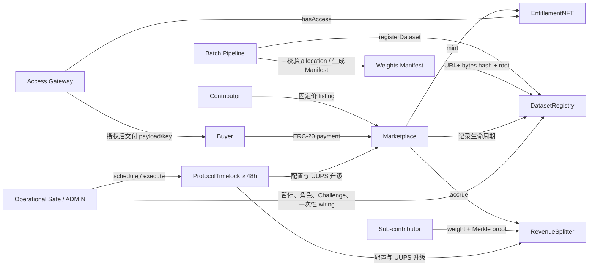

# Main Protocol

[English](README_EN.md) | 中文

Main Protocol 是面向数据资产的 EVM 市场与结算协议。固定价 V1 负责登记 Dataset、记录内容与权重承诺、销售 Copy License 或 Exclusive Title、铸造 ERC-1155 权益，并按照公开 Merkle 权重向 sub-contributor 分配销售收入。

重计算、数据打包、加密、Manifest 发布和密钥交付保留在链下；链上只保存可验证承诺、销售状态、访问权益和资金账本。

> 当前状态：固定价 V1 合约、测试、部署与验证工具已经实现。2026-08-18 使用临时 EOA 管理员完成的 Base Sepolia 部署早于原文五参数 `DatasetRegistered` 事件恢复，因而不再代表当前 bytecode；当前源码必须重新部署和验证。生产 Safe、多签 onboarding/wiring、独立智能合约审计、Gateway/Pipeline 运营验收仍是发布门槛。

## 目录

- [功能范围](#功能范围)
- [系统架构](#系统架构)
- [核心合约](#核心合约)
- [角色与治理](#角色与治理)
- [核心业务流程](#核心业务流程)
- [权重与收入分配](#权重与收入分配)
- [Challenge 模型](#challenge-模型)
- [安全模型与限制](#安全模型与限制)
- [技术栈](#技术栈)
- [快速开始](#快速开始)
- [常用命令](#常用命令)
- [权重 Manifest 工作流](#权重-manifest-工作流)
- [部署与链上验证](#部署与链上验证)
- [Base Sepolia 实网验收](#base-sepolia-实网验收)
- [测试与质量门槛](#测试与质量门槛)
- [项目结构](#项目结构)
- [相关文档](#相关文档)

## 功能范围

### 固定价 V1 已实现

- Dataset 顺序登记，以及内容哈希、公开样本 URI、加密 payload URI 和标签记录。
- 版本化 Weights Manifest 的 URI、原始字节哈希、Merkle root 和总权重承诺。
- Copy 与 Exclusive 两种固定价 Listing。
- ERC-1155 Copy License 与 Exclusive Title。
- 购买价格、交易截止时间和卖家费率上限保护。
- 按 Dataset 隔离的收入累计与 Merkle proof pull-claim。
- 管理员介导的权重 Challenge、证据承诺和 fail-closed 状态机。
- 协议暂停、48 小时 Timelock 治理、UUPS 升级和受限 Token rescue。
- Access Gateway 可调用的 `hasAccess(datasetId, who)` 链上访问判断。
- 严格部署验证、Manifest/Challenge schema 校验、Base Sepolia 角色验收脚本。

### 当前不包含

- Crowdsourcing Protocol 合约。
- AuctionHouse、拍卖 Listing、`bid`、`settle`、托管退款或 anti-snipe。
- Arcade submission、epoch、commit-reveal、honeypot、共识或标签评分。
- Batch Pipeline 服务本身，包括权重计算、打包、加密和存储发布。
- Access Gateway 服务本身，包括签名、解密、密钥托管和数据交付。
- Permissionless on-chain challenge、challenger bond、链上 proof 裁决或挑战奖励。
- KYC、协议管理的 Exclusive 二级市场、二级转让版税。

## 系统架构



主要信任边界：

- Pipeline 负责正确计算权重；严格 validator、公开 Manifest 和 Challenge 使结果可以独立复核。
- Gateway 负责 payload 可用性和密钥交付；它不能铸造权益或绕过 `hasAccess`。
- Operational Safe 负责即时运营操作；配置变更和升级必须经过 Timelock。
- 支付 Token 必须是经过审查的 exact-transfer、非 rebase ERC-20。

## 核心合约

| 合约                  | 类型            | 职责                                                                                                     |
| --------------------- | --------------- | -------------------------------------------------------------------------------------------------------- |
| `ContributorRegistry` | 非升级          | 管理 `ADMIN_ROLE`、`OPERATOR_ROLE`、`CONTRIBUTOR_ROLE`，并将一个 Operator 映射到其可代表的 Contributor。 |
| `ProtocolConfig`      | 非升级          | 保存不可变支付 Token，以及 fee、Treasury、challenge window、Gateway signer 和全局暂停状态。              |
| `DatasetRegistry`     | 非升级          | 登记 Dataset、保存 Manifest/Challenge 承诺、管理 Dataset 生命周期和权重永久失效状态。                    |
| `EntitlementNFT`      | 非升级 ERC-1155 | 铸造 Copy/Exclusive 权益并实现 `hasAccess`。Copy 不可转让；已铸造 Exclusive 可转让。                     |
| `Marketplace`         | UUPS Proxy      | 创建/撤销固定价 Listing，执行 Copy/Exclusive 购买、收款、结算和权益铸造。                                |
| `RevenueSplitter`     | UUPS Proxy      | 记录协议费和 Dataset 净收入，验证 Merkle proof，执行 claim、Treasury 提取和受限 rescue。                 |
| `ProtocolTimelock`    | 非升级          | OpenZeppelin Timelock，固定最低 48 小时延迟，控制配置与 UUPS 升级。                                      |

接口位于 `contracts/interfaces/`，固定价 V1 的主要外部入口为：

```solidity
registerDataset(RegisterParams p)
listCopy(uint256 datasetId, uint256 price)
listExclusiveFixed(uint256 datasetId, uint256 price)
delist(uint256 datasetId, SaleKind kind)
buyCopy(uint256 datasetId, uint256 expectedPrice, uint256 deadline)
buyExclusive(uint256 datasetId, uint256 expectedPrice, uint256 deadline)
claim(uint256 datasetId, uint256 weight, bytes32[] proof)
hasAccess(uint256 datasetId, address who)
```

## 角色与治理

| 主体                            | 权限与责任                                                                                       |
| ------------------------------- | ------------------------------------------------------------------------------------------------ |
| `ProtocolTimelock`              | 所有核心合约唯一、锁定的 `DEFAULT_ADMIN_ROLE`；控制配置 setter、角色管理员和 UUPS 升级。         |
| Operational Safe / `ADMIN_ROLE` | 管理 Contributor/Operator、一次性 Marketplace wiring、立即 pause/unpause、记录和裁决 Challenge。 |
| `CONTRIBUTOR_ROLE`              | 为自己登记 Dataset，管理自己 Dataset 的 Listing。                                                |
| `OPERATOR_ROLE`                 | 仅能为 `operatorContributor(operator)` 指定的 allowlisted Contributor 登记 Dataset。             |
| Buyer                           | Permissionless 购买有效 Listing；必须提供 expected price 和 deadline。                           |
| Sub-contributor / Claimant      | 使用自己的 `(address, weight)` leaf 和 proof 拉取累计收入。                                      |
| Treasury                        | 接收协议费；任何人都可触发 `withdrawTreasury()`，但资金只能发往配置的 Treasury。                 |
| Gateway signer                  | 仅表示链下 Gateway 身份；没有 mint、管理或访问绕过权限。                                         |

生产部署要求：

- Timelock 只能由自身持有 `DEFAULT_ADMIN_ROLE`，最低延迟不能降至 48 小时以下。
- Operational Safe 是 Timelock 的 proposer、executor 和 canceller。
- 初始 `CONTRIBUTOR_ROLE` 只有 `NURTURE_CONTRIBUTOR`。
- `PIPELINE_OPERATOR` 必须只有 Operator 身份，不能同时是 Contributor，并且只映射到 Nurture。
- 部署者 EOA 不得残留任何生产管理角色。

## 核心业务流程

### 1. Dataset 登记

1. Pipeline 生成 allocation，验证地址唯一、所有权重为正、单权重不超过总权重、权重和严格等于 `totalWeight`。
2. Pipeline 从目标链读取 `chainId`、Registry 地址和 `nextDatasetId()`，生成完整 Weights Manifest 与 proof。
3. Manifest 公开发布到 IPFS、Arweave、DA 或等价的可用存储。
4. Contributor 自己或其指定 Operator 调用 `registerDataset`。
5. Registry 锁定 content、URI、Manifest、Merkle root、total weight 和 SalePolicy；权重不能原地修改。
6. Dataset 初始状态为 `Draft`，并记录可配置挑战窗口结束时间。

登记校验包括：预期 Dataset ID 必须与顺序 ID 一致；hash/root/Manifest hash 非零；URI 非空；`totalWeight > 0`；至少启用一种销售类型；`licensesTransferable` 必须为 `false`。

### 2. Listing

- 只有 Dataset 的 Contributor 可以创建或撤销 Listing。
- V1 只有固定价格；有效 Listing 的价格不可修改，改价必须先 delist 再重新创建。
- Listing 会快照创建时的 `feeBps` 为 `maxFeeBps`。
- 挑战窗口内可以公开 Listing 供审查，但不能购买或 claim。
- 第一个 Listing 将 Dataset 变为 `Listed`；最后一个 Listing 被撤销后变为 `Delisted`。

### 3. Copy 购买

1. Buyer 读取 Listing 当前价格并授权支付 Token。
2. Buyer 调用 `buyCopy(datasetId, expectedPrice, deadline)`。
3. Marketplace 校验协议未暂停、Listing 有效、价格未变化、deadline 未过期、当前费率未超过 Listing 上限、挑战窗口已结束且 Challenge 为 `None` 或 `Rejected`。
4. 支付 Token 精确转入 RevenueSplitter；非精确到账会回滚。
5. RevenueSplitter 记录 fee 和 Dataset 净收入。
6. 为 Buyer 铸造一份不可转让 Copy License，并增加 `copiesSold`。

同一地址不能重复购买同一 Dataset 的 Copy；不同地址之间的 Copy 数量不设上限。

### 4. Exclusive 购买

- Buyer 调用 `buyExclusive(datasetId, expectedPrice, deadline)`，使用与 Copy 相同的执行保护。
- 如果 `exclusiveRequiresZeroCopies == true`，有任何 Copy 售出后都不能进行 Exclusive 销售；第一笔 Copy 也会自动关闭已有 Exclusive Listing。
- 成功后关闭两种 Listing，Dataset 进入终态 `ExclusivelySold`，并铸造唯一 Exclusive Title。
- Exclusive Title 铸造后可以按标准 ERC-1155 转让，但 V1 不处理转让价格、协议费或版税。
- Exclusive 售出后，`hasAccess` 只认可当前 Exclusive Title 持有人。历史 Copy 持有人保留已获得的字节，但 Gateway 不再提供重新下载或密钥交付。

### 5. Gateway 访问

Gateway 获取 Dataset 的 `payloadURI`，并调用：

```solidity
EntitlementNFT.hasAccess(datasetId, requester)
```

只有返回 `true` 时才应交付 payload 或解密密钥。Gateway 必须另外验证内容哈希、保护密钥、记录审计日志并处理存储可用性；这些职责不由链上合约实现。

## 权重与收入分配

### Manifest 绑定

`main-protocol.weights-manifest.v1` 将以下信息唯一绑定：

- Dataset ID、Chain ID、DatasetRegistry 地址；
- `keccak256(abi.encode(address,uint256))` leaf 编码；
- `sorted-keccak256;promote-unpaired` 树规则；
- 完整、地址唯一的 `(address, weight, proof)` 列表；
- `totalWeight`、`weightsRoot`；
- Pipeline 版本、生成时间和内容摘要。

链上保存 `weightsURI`、`keccak256(Manifest 原始字节)` 和 schema version。Claimant 可在不联系运营方的情况下发现、下载和验证自己的 weight/proof。

### 收入公式

每笔销售：

```text
fee = floor(gross × feeBps / 10,000)
net = gross - fee
cumulativeRevenue[datasetId] += net
unclaimedRevenue[datasetId] += net
```

某地址累计应得收入：

```text
entitled = floor(weight × cumulativeRevenue[datasetId] / totalWeight)
owed = entitled - claimed[datasetId][address]
```

Claim 成功后更新累计已领取值，并同时减少该 Dataset 的 `unclaimedRevenue` 和全局 `contributorBalance`。

关键保护：

- `unclaimedRevenue[datasetId]` 将每个 Dataset 的未领取资金隔离，错误树不能透支其他 Dataset。
- Claim 拒绝 `weight > totalWeight`、无效 proof、无新增应得金额和 Dataset 余额不足。
- 每次 payout 前检查 Token backing 至少等于 `treasuryBalance + contributorBalance`。
- 进出账都检查精确余额差；fee-on-transfer、rebase 和异常 Token 不受支持。
- 整数除法 dust 保留在 contributor 负债中，不能通过 rescue 提走。

## Challenge 模型

V1 是管理员介导的 Challenge，不是 permissionless on-chain challenge：

1. 任何人可通过公开链下入口提交 `main-protocol.weight-challenge-evidence.v1` 证据。
2. 证据必须绑定 Dataset、Chain、Registry、weights root、challenger、时间、原因和带摘要的 artifacts。
3. 运营目标是在 24 小时内确认有效提交。
4. 只有 Operational Safe 的 `ADMIN_ROLE` 可在挑战窗口结束前调用 `recordChallenge`，链上保存 evidence URI、原始字节 hash 和记录时间。
5. `Pending` 状态阻止 Listing/relisting、购买和 claim，并公开固定 72 小时 `challengeResolutionDueAt`。
6. ADMIN 调用 `resolveChallenge(datasetId, upheld)`：
   - `Rejected`：Dataset 可在挑战窗口结束后继续销售和 claim；同一窗口内仍可记录新的有效 Challenge。
   - `Upheld`：权重永久失效、Dataset 变为 `Delisted`、全部 Listing 关闭，后续销售和 claim 永久阻止。
7. Pending 超时不会自动通过或驳回，仍保持 fail-closed，并触发运营升级。

由于购买在挑战窗口结束前被禁止，V1 不设计收入迁移、自动退款、挑战 bond 或链上裁决。修正后的权重必须登记为新的 Dataset 版本。

## 安全模型与限制

### 已实现的关键控制

- OpenZeppelin `ReentrancyGuardTransient`、`SafeERC20`、UUPS 和 Timelock。
- Buyer 的 `expectedPrice` 与 `deadline` 防止价格变化和过期执行。
- Listing 的 `maxFeeBps` 防止治理提高费率后静默损害卖家。
- Copy 不可转让、重复购买拒绝、Exclusive 终态与 zero-copy 约束。
- Manifest 与 Challenge evidence 的严格 JSON Schema 和上下文绑定。
- 每 Dataset 资金隔离、全局负债 backing 和精确 Token 余额差检查。
- 一次性 Marketplace wiring，并验证 Marketplace 反向依赖。
- 精确角色成员、Safe 配置、runtime code hash、代理 implementation 和 schema 常量验证。
- Timelock 独占且不可转移的默认管理员权限。
- `rescueToken` 只能由 Timelock 调用；支付 Token 只能提取超出全部已记录负债的 surplus。

### 必须理解的限制

- 权重计算仍发生在 Pipeline；链上不能从原始数据重新计算权重。公开 Manifest、独立 validator 和 Challenge 是 V1 的控制手段。
- Exclusive 阻止未来协议销售，但无法撤回已经交付的数据。
- Gateway/Pipeline/存储可用性、密钥管理和争议响应是链下运营责任。
- Leaf 使用源设计规定的单次 `keccak256(abi.encode(address,uint256))`。仓库已记录 OpenZeppelin 64-byte leaf 警告的兼容性风险；生产前仍需独立审计确认。
- `ReentrancyGuardTransient` 依赖 EIP-1153，因此目标网络必须支持 Cancun transient storage。
- 仅支持经过审查的标准 exact-transfer、非 rebase ERC-20；黑名单、暂停和 Token 升级风险需单独评估。
- 测试通过不等于生产安全；Safe 实际执行、外部审计、监控和运营演练不可省略。

### Pause 行为

Pause 会阻止登记、listing/relisting、购买和 claim。读取、`claimable`、delist、Challenge 记录/裁决、Treasury 提取以及 unpause 仍可执行。

## 技术栈

- Solidity `0.8.28`
- EVM target：`cancun`
- Hardhat `3.13.0`
- TypeScript、Ethers `6.17.0`
- OpenZeppelin Contracts / Upgradeable `5.6.1`
- Safe Smart Account `1.5.0`（集成测试）
- Mocha / Chai、Solhint、Prettier、AJV
- Slither `0.11.5`（安全静态分析基线）

建议使用 Node.js 22 或更高版本，并通过 `npm ci` 严格使用锁文件。

## 快速开始

```bash
git clone <repository-url>
cd main-protocol
npm ci
npm run compile
npm test
```

运行完整质量门槛：

```bash
npm run ci
```

本地环境变量从模板开始；真实 `.env` 已被 Git 忽略：

```bash
test -e .env || cp .env.example .env
```

不得将私钥、Safe owner 信息、Gateway 密钥或真实 `.env` 提交到仓库。

## 常用命令

| 命令                                                       | 作用                                                       |
| ---------------------------------------------------------- | ---------------------------------------------------------- |
| `npm run compile`                                          | 编译 Solidity 合约。                                       |
| `npm test`                                                 | 执行全部 Hardhat 测试。                                    |
| `npm run coverage`                                         | 执行覆盖率测试。                                           |
| `npm run gas`                                              | 生成 Gas 统计。                                            |
| `npm run typecheck`                                        | TypeScript 静态检查。                                      |
| `npm run lint:sol`                                         | Solidity lint。                                            |
| `npm run format:check`                                     | 检查 Prettier 格式。                                       |
| `npm run audit:deps`                                       | 执行开发工具链和生产依赖审计门槛。                         |
| `npm run ci`                                               | 格式、lint、类型、依赖、allocation vector 与覆盖率总门槛。 |
| `npm run deploy -- --network <network>`                    | 部署协议。                                                 |
| `npm run verify:deployment -- --network <network>`         | 对已部署协议执行严格链上验证。                             |
| `npm run validate:allocation`                              | 严格校验 Pipeline allocation。                             |
| `npm run generate:weights-manifest -- --network <network>` | 从 allocation 和链上上下文生成 Manifest。                  |
| `npm run verify:weights-manifest -- --network <network>`   | 下载并对照链上 commitment 验证 Manifest。                  |
| `npm run validate:challenge-evidence`                      | 校验 Challenge evidence 和可选 commitment。                |
| `npm run clean`                                            | 清理 Hardhat 产物。                                        |

也可使用 `test:<module>` 命令单独运行 ContributorRegistry、ProtocolConfig、DatasetRegistry、EntitlementNFT、RevenueSplitter 或 Marketplace 测试，详见 `package.json`。

## 权重 Manifest 工作流

### 1. 准备并校验 allocation

格式示例见 `test-vectors/allocation.json`：

```json
{
  "totalWeight": "100",
  "root": "0x...",
  "entries": [
    { "address": "0x...", "weight": "40" },
    { "address": "0x...", "weight": "60" }
  ]
}
```

```bash
ALLOCATION_FILE=./allocation.json npm run validate:allocation
```

Validator 会重新计算 root，并拒绝未知字段、零/重复地址、非正整数、单项超额、总和错误或 root 不匹配。

### 2. 生成 Manifest

```bash
ALLOCATION_FILE=./allocation.json \
DATASET_REGISTRY=0x... \
EXPECTED_CHAIN_ID=84532 \
PIPELINE_VERSION=pipeline-v1.0.0 \
GENERATED_AT=2026-08-18T00:00:00.000Z \
CONTENT_DIGEST=0x... \
MANIFEST_OUTPUT_FILE=./weights-manifest.json \
npm run generate:weights-manifest -- --network baseSepolia
```

脚本直接读取目标链 `nextDatasetId()` 和 schema version，并使用独占创建模式，避免静默覆盖已有 Manifest。发布生成文件的精确字节后，将 URI、输出的 `weightsManifestHash`、root 和 totalWeight 用于 `registerDataset`。

### 3. 独立验证链上 Manifest

```bash
DATASET_REGISTRY=0x... \
DATASET_ID=1 \
CLAIMANT_ADDRESS=0x... \
npm run verify:weights-manifest -- --network baseSepolia
```

对 `ipfs://` URI 可设置 `IPFS_GATEWAY_URL`。验证会检查原始字节 hash、schema、链/Registry/Dataset 绑定、完整 allocation、root 和所有 proof。

### 4. 校验 Challenge evidence

```bash
EVIDENCE_FILE=./challenge-evidence.json \
DATASET_ID=1 \
EXPECTED_CHAIN_ID=84532 \
DATASET_REGISTRY=0x... \
WEIGHTS_ROOT=0x... \
EXPECTED_EVIDENCE_HASH=0x... \
npm run validate:challenge-evidence
```

如果尚未有链上 commitment，可以省略 `EXPECTED_EVIDENCE_HASH`，脚本会输出待提交的 evidence hash。Schema 位于 `schemas/weight-challenge-evidence-v1.schema.json`。

## 部署与链上验证

Hardhat 已配置以下持久网络：

| Hardhat 网络名 | Canonical Chain ID | 用途     |
| -------------- | -----------------: | -------- |
| `baseSepolia`  |              84532 | 测试部署 |
| `base`         |               8453 | 生产候选 |
| `arbitrum`     |              42161 | 生产候选 |
| `optimism`     |                 10 | 生产候选 |

### 部署前环境

根据 `.env.example` 设置：

- RPC、`DEPLOYER_PRIVATE_KEY`、`EXPECTED_CHAIN_ID` 和 `EIP1153_CONFIRMED=true`；
- 支付 Token 地址、decimals、runtime code hash；
- Safe 地址、proxy/singleton code hash、精确 owners、threshold、guard、fallback handler；
- Treasury、Gateway signer、Nurture Contributor、Pipeline Operator；
- fee 和 challenge window。

`EIP1153_CONFIRMED=true` 必须来自人工网络能力确认，不能只为让脚本通过而设置。

### 部署

```bash
npm run deploy -- --network baseSepolia
```

生产 Safe 模式下，部署结果会返回 6 笔需由 Safe 执行的管理员交易：

1. 授予 Nurture `CONTRIBUTOR_ROLE`；
2. 授予 Pipeline `OPERATOR_ROLE`；
3. 设置 Pipeline → Nurture 映射；
4. wiring DatasetRegistry → Marketplace；
5. wiring EntitlementNFT → Marketplace；
6. wiring RevenueSplitter → Marketplace。

这些交易必须由 Safe 收集阈值签名并实际执行；只生成 calldata 不算完成。

### 严格验证

将部署输出中的地址和 runtime code hash 写入本地 `.env`，然后运行：

```bash
npm run verify:deployment -- --network baseSepolia
```

验证包括：网络名与 Chain ID、EIP-1153 确认、支付 Token、Safe proxy/singleton/owners/threshold/modules/guard/fallback、Timelock 角色与延迟、全部核心角色精确成员、wiring、配置、UUPS implementation、runtime code hash、Manifest/Challenge schema 常量和 SLA。

生产发布前请逐项完成 `security/PRODUCTION_SECURITY_CHECKLIST.md`。

## Base Sepolia 实网验收

当前 Base Sepolia 部署信息和逐角色操作说明位于：

- `.env.base-sepolia-live.example`：公开地址、代码哈希和无密钥字段模板；
- `BASE_SEPOLIA_LIVE_TESTING.md`：完整真实 RPC/真实账户验收流程。

先编译并进行只读验收：

```bash
npm ci
npm run compile
npm run live:base-sepolia:inspect
npm run live:base-sepolia:all
```

按角色运行：

```bash
npm run live:base-sepolia:admin
npm run live:base-sepolia:timelock
npm run live:base-sepolia:contributor
npm run live:base-sepolia:operator
npm run live:base-sepolia:buyer
npm run live:base-sepolia:claimant
npm run live:base-sepolia:treasury
npm run live:base-sepolia:gateway
```

真实写操作同时要求命令行 `--write --confirm` 和 `.env` 中 `ALLOW_BASE_SEPOLIA_WRITES=true`。临时 EOA ADMIN 测试还必须显式启用对应 test-only 开关；生产验收必须恢复为 Safe。

测试账户初始化命令：

```bash
npm run live:base-sepolia:setup-test-accounts -- --write --confirm
```

每个脚本输出 `PASS/FAIL/SKIP`，并在 `reports/base-sepolia-live/` 生成不含私钥的 JSON 报告。任何 SKIP 都不能被解释为已验证通过。

## 测试与质量门槛

当前开发规范记录的基线：

- 156 个自动化测试全部通过；
- Line coverage：98.61%；
- Statement coverage：98.57%；
- Slither 0.11.5：无 High severity finding；
- 生产依赖审计：0 漏洞；
- 完整开发工具链：无 Critical/High/Moderate，剩余 Low 已记录；
- Official Safe 集成测试要求 2/2 owner 签名，验证 nonce replay 拒绝，并执行 6 笔 onboarding/wiring 交易。

CI 工作流位于 `.github/workflows/ci.yml`。依赖策略和静态分析处置分别记录在：

- `security/DEPENDENCY_AUDIT.md`
- `security/SLITHER_REVIEW.md`

这些数据描述当前已验证基线；任何合约、依赖、编译器、网络或部署配置变化都必须重新运行完整门槛。

## 项目结构

```text
contracts/
  interfaces/                 协议接口和共享数据结构
  test/                       仅用于测试的 Mock/攻击合约
  utils/                      固定治理访问控制
  *.sol                       七个核心合约
schemas/                      Manifest 与 Challenge evidence JSON Schema
scripts/
  base-sepolia/               真实 RPC、逐角色验收脚本
  lib/                        部署、验证、Merkle 与 schema 工具
  deploy.ts                   部署入口
  verify-deployment.ts        严格部署验证入口
test/
  unit/                       单元与拒绝分支测试
  integration/                购买、部署和 Safe 集成测试
  acceptance/                 跨系统工件与测试向量验收
test-vectors/                 Allocation/Merkle 固定测试向量
security/                     发布安全清单、依赖和 Slither 审查
*.md                          开发规范与各角色操作手册
```

## 相关文档

| 文档                                        | 内容                                            |
| ------------------------------------------- | ----------------------------------------------- |
| `protocol_technical_design.md`              | 原始技术设计来源。                              |
| `MAIN_PROTOCOL_DEVELOPMENT_SPEC.md`         | V1 决策、接口、规则、验收与实现状态的开发基准。 |
| `FRONTEND_INTEGRATION_GUIDE.md`             | 前端、Indexer、Gateway 与 QA 的完整接入手册。   |
| `OPERATOR_OPERATION_MANUAL.md`              | Pipeline/Operator 登记与 Manifest 操作。        |
| `BUYER_OPERATION_MANUAL.md`                 | Copy/Exclusive 买家流程。                       |
| `ADMIN_MULTISIG_OPERATION_MANUAL.md`        | Operational Safe、暂停和 Challenge 操作。       |
| `TIMELOCK_GOVERNANCE_OPERATION_MANUAL.md`   | Timelock 配置、升级和 rescue。                  |
| `BASE_SEPOLIA_LIVE_TESTING.md`              | Base Sepolia 逐角色真实链验收。                 |
| `security/PRODUCTION_SECURITY_CHECKLIST.md` | 生产发布门槛。                                  |

规则优先级：`protocol_technical_design.md` 是原始来源；`MAIN_PROTOCOL_DEVELOPMENT_SPEC.md` 中明确记录的 V1 决策用于解决原文档未定项或明确暂缓项。实现、测试和对外描述必须与这两个文件保持一致。

## 生产发布声明

在以下事项全部完成前，不应使用本项目承载真实用户资金，也不应对外声称已实现完整 permissionless optimistic challenge：

- 生产 Safe 配置和 6 笔 onboarding/wiring 交易真实执行；
- 目标网络完整部署验证和代码哈希留档；
- 独立智能合约审计及问题处置；
- Pipeline、公开 Manifest、Challenge intake、Gateway、密钥管理和监控 SLA 验收；
- 支付 Token、存储可用性和事件监控的生产评审。

合约源文件使用 SPDX `MIT` 标识；仓库级授权以正式发布时提供的 LICENSE 文件为准。
