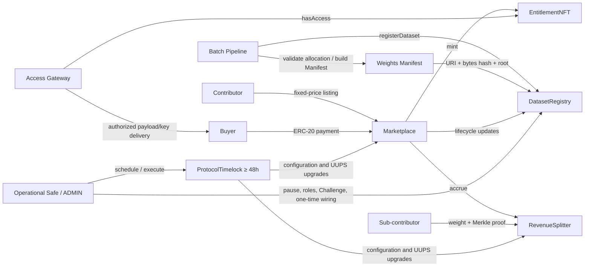

# Main Protocol

English | [中文](README.md)

Main Protocol is an EVM marketplace and settlement protocol for data assets. The fixed-price V1 registers Datasets, commits content and weight information, sells Copy Licenses or Exclusive Titles, mints ERC-1155 entitlements, and distributes sale revenue to sub-contributors according to a public Merkle allocation.

Heavy computation, data packaging, encryption, Manifest publication, and key delivery remain off-chain. The contracts store verifiable commitments, sale state, access entitlements, and settlement accounting.

> Current status: the fixed-price V1 contracts, tests, deployment tooling, and verification tooling are implemented. The Base Sepolia deployment completed with a temporary EOA administrator on 2026-08-18 predates restoration of the source-defined five-parameter `DatasetRegistered` event and no longer represents the current bytecode; the current source requires a fresh deployment and verification. A production Safe, actual multisig onboarding/wiring execution, an independent smart-contract audit, and Gateway/Pipeline operational acceptance remain release gates.

## Contents

- [Scope](#scope)
- [Architecture](#architecture)
- [Core contracts](#core-contracts)
- [Roles and governance](#roles-and-governance)
- [Core flows](#core-flows)
- [Weights and revenue distribution](#weights-and-revenue-distribution)
- [Challenge model](#challenge-model)
- [Security model and limitations](#security-model-and-limitations)
- [Technology](#technology)
- [Quick start](#quick-start)
- [Commands](#commands)
- [Weights Manifest workflow](#weights-manifest-workflow)
- [Deployment and on-chain verification](#deployment-and-on-chain-verification)
- [Base Sepolia live acceptance](#base-sepolia-live-acceptance)
- [Tests and quality gates](#tests-and-quality-gates)
- [Repository layout](#repository-layout)
- [Documentation](#documentation)

## Scope

### Implemented in fixed-price V1

- Sequential Dataset registration with a content hash, public sample URI, encrypted payload URI, and tag.
- Versioned Weights Manifest URI, raw-byte digest, Merkle root, and total-weight commitment.
- Fixed-price Copy and Exclusive listings.
- ERC-1155 Copy Licenses and Exclusive Titles.
- Buyer price/deadline protection and seller fee-cap protection.
- Per-Dataset revenue accrual and Merkle-proof pull claims.
- Administrator-mediated weight Challenges with evidence commitments and a fail-closed state machine.
- Protocol pause, 48-hour Timelock governance, UUPS upgrades, and constrained token rescue.
- An on-chain `hasAccess(datasetId, who)` view for the Access Gateway.
- Strict deployment verification, Manifest/Challenge schema validation, and Base Sepolia role-based acceptance scripts.

### Not included

- The Crowdsourcing Protocol contracts.
- AuctionHouse, auction listings, `bid`, `settle`, escrow refunds, or anti-snipe behavior.
- Arcade submissions, epochs, commit-reveal, honeypots, consensus, or label scoring.
- The Batch Pipeline service itself, including weight computation, packaging, encryption, and storage publication.
- The Access Gateway service itself, including signatures, decryption, key custody, and data delivery.
- Permissionless on-chain challenges, challenger bonds, on-chain proof adjudication, or challenge rewards.
- KYC, a protocol-managed Exclusive secondary market, or royalties on secondary transfers.

## Architecture



Primary trust boundaries:

- The Pipeline computes weights correctly; strict validation, a public Manifest, and the Challenge process make the output independently reviewable.
- The Gateway provides payload availability and key delivery; it cannot mint entitlements or bypass `hasAccess`.
- The Operational Safe performs immediate operational actions; configuration changes and upgrades must pass through the Timelock.
- The payment token must be a reviewed exact-transfer, non-rebasing ERC-20.

## Core contracts

| Contract              | Type                     | Responsibility                                                                                                                                  |
| --------------------- | ------------------------ | ----------------------------------------------------------------------------------------------------------------------------------------------- |
| `ContributorRegistry` | Non-upgradeable          | Manages `ADMIN_ROLE`, `OPERATOR_ROLE`, and `CONTRIBUTOR_ROLE`, and maps each Operator to the Contributor it may represent.                      |
| `ProtocolConfig`      | Non-upgradeable          | Stores the immutable payment token and the fee, Treasury, challenge window, Gateway signer, and global pause state.                             |
| `DatasetRegistry`     | Non-upgradeable          | Registers Datasets, stores Manifest/Challenge commitments, and manages Dataset lifecycle and permanent weight invalidation.                     |
| `EntitlementNFT`      | Non-upgradeable ERC-1155 | Mints Copy/Exclusive entitlements and implements `hasAccess`. Copy Licenses are non-transferable; minted Exclusive Titles are transferable.     |
| `Marketplace`         | UUPS proxy               | Creates and removes fixed-price listings and executes Copy/Exclusive payment, settlement, and minting.                                          |
| `RevenueSplitter`     | UUPS proxy               | Accounts for protocol fees and Dataset net revenue, verifies Merkle proofs, and implements claims, Treasury withdrawal, and constrained rescue. |
| `ProtocolTimelock`    | Non-upgradeable          | OpenZeppelin Timelock with a fixed 48-hour minimum delay controlling configuration and UUPS upgrades.                                           |

Interfaces are in `contracts/interfaces/`. The primary fixed-price V1 entry points are:

```solidity
registerDataset(RegisterParams p)
listCopy(uint256 datasetId, uint256 price)
listExclusiveFixed(uint256 datasetId, uint256 price)
delist(uint256 datasetId, SaleKind kind)
buyCopy(uint256 datasetId, uint256 expectedPrice, uint256 deadline)
buyExclusive(uint256 datasetId, uint256 expectedPrice, uint256 deadline)
claim(uint256 datasetId, uint256 weight, bytes32[] proof)
hasAccess(uint256 datasetId, address who)
```

## Roles and governance

| Actor                           | Authority and responsibility                                                                                                                 |
| ------------------------------- | -------------------------------------------------------------------------------------------------------------------------------------------- |
| `ProtocolTimelock`              | The sole, locked `DEFAULT_ADMIN_ROLE` holder on every core contract; controls configuration setters, role administration, and UUPS upgrades. |
| Operational Safe / `ADMIN_ROLE` | Manages Contributors/Operators, performs one-time Marketplace wiring, immediately pauses/unpauses, and records/resolves Challenges.          |
| `CONTRIBUTOR_ROLE`              | Registers its own Datasets and manages listings for its own Datasets.                                                                        |
| `OPERATOR_ROLE`                 | Registers only for the allowlisted Contributor returned by `operatorContributor(operator)`.                                                  |
| Buyer                           | Permissionlessly purchases a valid listing while supplying an expected price and deadline.                                                   |
| Sub-contributor / Claimant      | Pulls accrued revenue using its `(address, weight)` leaf and proof.                                                                          |
| Treasury                        | Receives protocol fees. Anyone may trigger `withdrawTreasury()`, but funds can only go to the configured Treasury.                           |
| Gateway signer                  | Identifies the off-chain Gateway and has no mint, administrative, or access-bypass authority.                                                |

Production deployment requirements:

- The Timelock must be the only `DEFAULT_ADMIN_ROLE` holder, and its delay cannot be reduced below 48 hours.
- The Operational Safe is the Timelock proposer, executor, and canceller.
- `NURTURE_CONTRIBUTOR` is the only initial `CONTRIBUTOR_ROLE` member.
- `PIPELINE_OPERATOR` has only the Operator role, is not a Contributor, and maps only to Nurture.
- The deployer EOA retains no production administrative role.

## Core flows

### 1. Dataset registration

1. The Pipeline builds an allocation and checks unique addresses, positive weights, no individual weight above the total, and an exact sum equal to `totalWeight`.
2. It reads the destination `chainId`, Registry address, and `nextDatasetId()` and generates a complete Weights Manifest with proofs.
3. The Manifest is published to IPFS, Arweave, a DA layer, or equivalent availability-backed storage.
4. The Contributor or its assigned Operator calls `registerDataset`.
5. The Registry locks the content, URIs, Manifest commitment, Merkle root, total weight, and SalePolicy. Weights cannot be edited in place.
6. The Dataset starts in `Draft`, with a configurable challenge-window deadline.

Registration requires the expected sequential Dataset ID, nonzero hashes/root, nonempty URIs, `totalWeight > 0`, at least one enabled sale kind, and `licensesTransferable == false`.

### 2. Listing

- Only the Dataset Contributor may create or remove a listing.
- V1 supports fixed prices only. An active listing price is immutable; changing it requires delisting and relisting.
- A listing snapshots the current `feeBps` as `maxFeeBps`.
- A listing may be visible during the challenge window for review, but purchases and claims remain blocked.
- The first listing moves the Dataset to `Listed`; removing the final listing moves it to `Delisted`.

### 3. Copy purchase

1. The Buyer reads the current price and approves the payment token.
2. The Buyer calls `buyCopy(datasetId, expectedPrice, deadline)`.
3. Marketplace checks pause state, listing state, exact price, deadline, the current fee against the listing cap, challenge-window completion, and a Challenge state of `None` or `Rejected`.
4. The exact payment-token amount is transferred to RevenueSplitter; a non-exact receipt reverts.
5. RevenueSplitter accounts for the fee and Dataset net revenue.
6. A non-transferable Copy License is minted and `copiesSold` is incremented.

An address cannot buy the same Dataset Copy twice. Copy supply remains unlimited across distinct addresses.

### 4. Exclusive purchase

- The Buyer calls `buyExclusive(datasetId, expectedPrice, deadline)` with the same execution protections as a Copy purchase.
- If `exclusiveRequiresZeroCopies == true`, any previous Copy sale prevents an Exclusive sale. The first Copy sale also deactivates an existing Exclusive listing.
- A successful purchase closes both listings, moves the Dataset to terminal `ExclusivelySold`, and mints the unique Exclusive Title.
- A minted Exclusive Title is transferable under standard ERC-1155 behavior, but V1 collects no transfer payment, protocol fee, or royalty.
- After an Exclusive sale, `hasAccess` recognizes only the current Exclusive Title holder. Previous Copy holders keep bytes already delivered, but the Gateway no longer provides re-download or key delivery.

### 5. Gateway access

The Gateway obtains the Dataset `payloadURI` and calls:

```solidity
EntitlementNFT.hasAccess(datasetId, requester)
```

It should deliver the payload or decryption key only when the result is `true`. The Gateway must separately verify content hashes, protect keys, retain audit logs, and manage storage availability; those responsibilities are not implemented on-chain.

## Weights and revenue distribution

### Manifest binding

`main-protocol.weights-manifest.v1` uniquely binds:

- Dataset ID, Chain ID, and DatasetRegistry address;
- `keccak256(abi.encode(address,uint256))` leaf encoding;
- the `sorted-keccak256;promote-unpaired` tree rule;
- the complete, address-unique `(address, weight, proof)` allocation;
- `totalWeight` and `weightsRoot`;
- Pipeline version, generation timestamp, and content digest.

The Registry stores `weightsURI`, `keccak256(raw Manifest bytes)`, and the schema version. A Claimant can discover, download, and validate its weight and proof without contacting the operator.

### Revenue formulas

For each sale:

```text
fee = floor(gross × feeBps / 10,000)
net = gross - fee
cumulativeRevenue[datasetId] += net
unclaimedRevenue[datasetId] += net
```

The cumulative entitlement for an address is:

```text
entitled = floor(weight × cumulativeRevenue[datasetId] / totalWeight)
owed = entitled - claimed[datasetId][address]
```

A successful claim updates the cumulative claimed amount and reduces both that Dataset's `unclaimedRevenue` and the global `contributorBalance`.

Key protections:

- `unclaimedRevenue[datasetId]` isolates each Dataset's unpaid funds, preventing a malformed tree from consuming another Dataset's funds.
- Claims reject `weight > totalWeight`, an invalid proof, no newly owed amount, or insufficient Dataset balance.
- Every payout checks that token backing is at least `treasuryBalance + contributorBalance`.
- Ingress and egress check exact balance deltas; fee-on-transfer, rebasing, and other anomalous tokens are unsupported.
- Integer-division dust remains a contributor liability and cannot be rescued.

## Challenge model

V1 uses an administrator-mediated Challenge, not a permissionless on-chain challenge:

1. Anyone may submit a `main-protocol.weight-challenge-evidence.v1` document through the public off-chain intake.
2. Evidence binds the Dataset, Chain, Registry, weights root, challenger, timestamp, reason, and digest-addressed artifacts.
3. The operational acknowledgement target is 24 hours for a valid submission.
4. Only the Operational Safe's `ADMIN_ROLE` may call `recordChallenge` before the challenge window ends. The contract stores the evidence URI, raw-byte hash, and record time.
5. `Pending` blocks listing/relisting, purchases, and claims and publishes a fixed 72-hour `challengeResolutionDueAt`.
6. ADMIN calls `resolveChallenge(datasetId, upheld)`:
   - `Rejected`: the Dataset may sell and pay claims after the challenge window; another valid Challenge may still be recorded within the same window.
   - `Upheld`: weights are permanently invalidated, the Dataset becomes `Delisted`, all listings close, and later sales and claims remain permanently blocked.
7. An overdue Pending challenge does not auto-pass or auto-reject. It remains fail-closed and triggers operational escalation.

Because purchases are prohibited before the challenge window closes, V1 does not implement revenue migration, automatic refunds, challenge bonds, or on-chain adjudication. Corrected weights require a newly registered Dataset version.

## Security model and limitations

### Implemented controls

- OpenZeppelin `ReentrancyGuardTransient`, `SafeERC20`, UUPS, and Timelock components.
- Buyer `expectedPrice` and `deadline` protection against price changes and stale execution.
- Listing `maxFeeBps` protection against silent seller harm after a governance fee increase.
- Non-transferable Copy Licenses, duplicate-purchase rejection, terminal Exclusive state, and zero-copy exclusivity rules.
- Strict JSON Schemas and context binding for Manifests and Challenge evidence.
- Per-Dataset fund isolation, global liability backing, and exact token balance-delta checks.
- One-time Marketplace wiring with reverse-dependency verification.
- Exact role membership, Safe configuration, runtime code hash, proxy implementation, and schema-constant verification.
- Timelock-exclusive and non-transferable default administration.
- Timelock-only `rescueToken`; payment-token rescue is limited to balance above all recorded liabilities.

### Limitations to understand

- Weight computation remains a Pipeline responsibility; contracts cannot recompute weights from raw data. The public Manifest, independent validator, and Challenge process are the V1 controls.
- Exclusive prevents future protocol sales but cannot retract data already delivered.
- Gateway/Pipeline/storage availability, key management, and dispute-response SLAs are off-chain operational responsibilities.
- Leaves retain the source-defined single `keccak256(abi.encode(address,uint256))`. The repository documents the OpenZeppelin 64-byte-leaf compatibility warning; an independent production audit must still confirm the acceptance.
- `ReentrancyGuardTransient` depends on EIP-1153, so the destination network must support Cancun transient storage.
- Only a reviewed standard exact-transfer, non-rebasing ERC-20 is supported. Blacklist, pause, and token-upgrade authority require separate review.
- Passing tests does not establish production safety. Actual Safe execution, external audit, monitoring, and operational rehearsals are mandatory.

### Pause behavior

Pause blocks registration, listing/relisting, purchases, and claims. Reads, `claimable`, delisting, Challenge recording/resolution, Treasury withdrawal, and unpause remain available.

## Technology

- Solidity `0.8.28`
- EVM target: `cancun`
- Hardhat `3.13.0`
- TypeScript and Ethers `6.17.0`
- OpenZeppelin Contracts / Upgradeable `5.6.1`
- Safe Smart Account `1.5.0` for integration tests
- Mocha / Chai, Solhint, Prettier, and AJV
- Slither `0.11.5` security-analysis baseline

Node.js 22 or newer is recommended. Use `npm ci` to honor the reviewed lockfile exactly.

## Quick start

```bash
git clone <repository-url>
cd main-protocol
npm ci
npm run compile
npm test
```

Run the complete quality gate:

```bash
npm run ci
```

Start local environment configuration from the template. The real `.env` is ignored by Git:

```bash
test -e .env || cp .env.example .env
```

Never commit private keys, Safe owner information, Gateway keys, or the real `.env`.

## Commands

| Command                                                    | Purpose                                                                    |
| ---------------------------------------------------------- | -------------------------------------------------------------------------- |
| `npm run compile`                                          | Compile Solidity contracts.                                                |
| `npm test`                                                 | Run the complete Hardhat test suite.                                       |
| `npm run coverage`                                         | Run coverage tests.                                                        |
| `npm run gas`                                              | Generate gas statistics.                                                   |
| `npm run typecheck`                                        | Run TypeScript static checks.                                              |
| `npm run lint:sol`                                         | Lint Solidity.                                                             |
| `npm run format:check`                                     | Check Prettier formatting.                                                 |
| `npm run audit:deps`                                       | Apply development-toolchain and production dependency audit gates.         |
| `npm run ci`                                               | Run format, lint, type, dependency, allocation-vector, and coverage gates. |
| `npm run deploy -- --network <network>`                    | Deploy the protocol.                                                       |
| `npm run verify:deployment -- --network <network>`         | Strictly verify an existing deployment.                                    |
| `npm run validate:allocation`                              | Strictly validate a Pipeline allocation.                                   |
| `npm run generate:weights-manifest -- --network <network>` | Generate a Manifest using allocation and live-chain context.               |
| `npm run verify:weights-manifest -- --network <network>`   | Download and validate a Manifest against its on-chain commitment.          |
| `npm run validate:challenge-evidence`                      | Validate Challenge evidence and an optional commitment.                    |
| `npm run clean`                                            | Remove Hardhat build products.                                             |

The `test:<module>` commands run focused ContributorRegistry, ProtocolConfig, DatasetRegistry, EntitlementNFT, RevenueSplitter, or Marketplace tests; see `package.json`.

## Weights Manifest workflow

### 1. Prepare and validate an allocation

See `test-vectors/allocation.json` for a complete example:

```json
{
  "totalWeight": "100",
  "root": "0x...",
  "entries": [
    { "address": "0x...", "weight": "40" },
    { "address": "0x...", "weight": "60" }
  ]
}
```

```bash
ALLOCATION_FILE=./allocation.json npm run validate:allocation
```

The validator recomputes the root and rejects unknown fields, zero or duplicate addresses, non-positive integers, an individual overweight entry, an incorrect sum, or a root mismatch.

### 2. Generate the Manifest

```bash
ALLOCATION_FILE=./allocation.json \
DATASET_REGISTRY=0x... \
EXPECTED_CHAIN_ID=84532 \
PIPELINE_VERSION=pipeline-v1.0.0 \
GENERATED_AT=2026-08-18T00:00:00.000Z \
CONTENT_DIGEST=0x... \
MANIFEST_OUTPUT_FILE=./weights-manifest.json \
npm run generate:weights-manifest -- --network baseSepolia
```

The script reads the destination `nextDatasetId()` and schema version and creates the output exclusively, preventing silent overwrite of an existing Manifest. Publish the exact generated bytes, then use the URI, emitted `weightsManifestHash`, root, and total weight in `registerDataset`.

### 3. Independently verify an on-chain Manifest

```bash
DATASET_REGISTRY=0x... \
DATASET_ID=1 \
CLAIMANT_ADDRESS=0x... \
npm run verify:weights-manifest -- --network baseSepolia
```

Set `IPFS_GATEWAY_URL` for `ipfs://` URIs when needed. Verification checks the raw-byte hash, schema, Chain/Registry/Dataset binding, complete allocation, root, and every proof.

### 4. Validate Challenge evidence

```bash
EVIDENCE_FILE=./challenge-evidence.json \
DATASET_ID=1 \
EXPECTED_CHAIN_ID=84532 \
DATASET_REGISTRY=0x... \
WEIGHTS_ROOT=0x... \
EXPECTED_EVIDENCE_HASH=0x... \
npm run validate:challenge-evidence
```

Before an on-chain commitment exists, omit `EXPECTED_EVIDENCE_HASH`; the script emits the evidence hash to be submitted. The schema is in `schemas/weight-challenge-evidence-v1.schema.json`.

## Deployment and on-chain verification

Hardhat defines these persistent networks:

| Hardhat network | Canonical Chain ID | Use                  |
| --------------- | -----------------: | -------------------- |
| `baseSepolia`   |              84532 | Test deployment      |
| `base`          |               8453 | Production candidate |
| `arbitrum`      |              42161 | Production candidate |
| `optimism`      |                 10 | Production candidate |

### Pre-deployment environment

Configure the following from `.env.example`:

- RPC, `DEPLOYER_PRIVATE_KEY`, `EXPECTED_CHAIN_ID`, and `EIP1153_CONFIRMED=true`;
- payment-token address, decimals, and runtime code hash;
- Safe address, proxy/singleton code hashes, exact owners, threshold, guard, and fallback handler;
- Treasury, Gateway signer, Nurture Contributor, and Pipeline Operator;
- fee and challenge window.

`EIP1153_CONFIRMED=true` must represent a human-reviewed network capability decision, not merely a value set to satisfy the script.

### Deploy

```bash
npm run deploy -- --network baseSepolia
```

In production Safe mode, deployment returns six administrative transactions for Safe execution:

1. Grant Nurture `CONTRIBUTOR_ROLE`.
2. Grant Pipeline `OPERATOR_ROLE`.
3. Set the Pipeline → Nurture mapping.
4. Wire DatasetRegistry → Marketplace.
5. Wire EntitlementNFT → Marketplace.
6. Wire RevenueSplitter → Marketplace.

The Safe must collect threshold signatures and execute these transactions. Producing calldata alone is not completion.

### Strict verification

Write the deployed addresses and runtime code hashes to the local `.env`, then run:

```bash
npm run verify:deployment -- --network baseSepolia
```

Verification covers network name and Chain ID, EIP-1153 confirmation, payment token, Safe proxy/singleton/owners/threshold/modules/guard/fallback, Timelock roles and delay, exact core-role membership, wiring, configuration, UUPS implementations, runtime code hashes, Manifest/Challenge schema constants, and the Challenge SLA.

Complete every item in `security/PRODUCTION_SECURITY_CHECKLIST.md` before production release.

## Base Sepolia live acceptance

The current Base Sepolia deployment information and role-based instructions are in:

- `.env.base-sepolia-live.example`: public addresses, code hashes, and a secret-free field template;
- `BASE_SEPOLIA_LIVE_TESTING.md`: the complete real-RPC, real-account acceptance workflow.

Compile and run read-only acceptance first:

```bash
npm ci
npm run compile
npm run live:base-sepolia:inspect
npm run live:base-sepolia:all
```

Run individual roles with:

```bash
npm run live:base-sepolia:admin
npm run live:base-sepolia:timelock
npm run live:base-sepolia:contributor
npm run live:base-sepolia:operator
npm run live:base-sepolia:buyer
npm run live:base-sepolia:claimant
npm run live:base-sepolia:treasury
npm run live:base-sepolia:gateway
```

A live write requires both `--write --confirm` and `ALLOW_BASE_SEPOLIA_WRITES=true` in `.env`. Temporary EOA ADMIN testing also requires its explicit test-only flag; production acceptance must restore a Safe.

Initialize dedicated test accounts with:

```bash
npm run live:base-sepolia:setup-test-accounts -- --write --confirm
```

Each script emits `PASS/FAIL/SKIP` and writes a private-key-free JSON report under `reports/base-sepolia-live/`. A SKIP must never be interpreted as a completed validation.

## Tests and quality gates

The current development-specification baseline records:

- 156 passing automated tests;
- 98.61% line coverage;
- 98.57% statement coverage;
- Slither 0.11.5 with no High-severity finding;
- zero production dependency vulnerabilities;
- no Critical/High/Moderate advisory in the complete development toolchain, with remaining Low findings documented;
- an official Safe integration test requiring 2/2 owner signatures, rejecting nonce replay, and executing all six onboarding/wiring transactions.

CI is defined in `.github/workflows/ci.yml`. Dependency policy and static-analysis dispositions are documented in:

- `security/DEPENDENCY_AUDIT.md`
- `security/SLITHER_REVIEW.md`

These values describe the currently verified baseline. Any contract, dependency, compiler, network, or deployment-configuration change requires rerunning the complete gate.

## Repository layout

```text
contracts/
  interfaces/                 Protocol interfaces and shared data structures
  test/                       Test-only mocks and adversarial contracts
  utils/                      Fixed-governance access control
  *.sol                       Seven core contracts
schemas/                      Manifest and Challenge evidence JSON Schemas
scripts/
  base-sepolia/               Real-RPC, role-based acceptance scripts
  lib/                        Deployment, verification, Merkle, and schema tools
  deploy.ts                   Deployment entry point
  verify-deployment.ts        Strict deployment-verification entry point
test/
  unit/                       Unit and rejection-branch tests
  integration/                Purchase, deployment, and Safe integration tests
  acceptance/                 Cross-system artifact and test-vector acceptance
test-vectors/                 Fixed allocation and Merkle vectors
security/                     Release checklist, dependency policy, and Slither review
*.md                          Development specification and role manuals
```

## Documentation

| Document                                    | Purpose                                                                          |
| ------------------------------------------- | -------------------------------------------------------------------------------- |
| `protocol_technical_design.md`              | Original technical-design source.                                                |
| `MAIN_PROTOCOL_DEVELOPMENT_SPEC.md`         | V1 decisions, interfaces, rules, acceptance criteria, and implementation status. |
| `OPERATOR_OPERATION_MANUAL.md`              | Pipeline/Operator registration and Manifest operations.                          |
| `BUYER_OPERATION_MANUAL.md`                 | Copy/Exclusive buyer workflow.                                                   |
| `ADMIN_MULTISIG_OPERATION_MANUAL.md`        | Operational Safe, pause, and Challenge procedures.                               |
| `TIMELOCK_GOVERNANCE_OPERATION_MANUAL.md`   | Timelock configuration, upgrades, and rescue.                                    |
| `BASE_SEPOLIA_LIVE_TESTING.md`              | Role-based Base Sepolia live acceptance.                                         |
| `security/PRODUCTION_SECURITY_CHECKLIST.md` | Production release gates.                                                        |

Rule precedence: `protocol_technical_design.md` is the original source. Explicit V1 decisions in `MAIN_PROTOCOL_DEVELOPMENT_SPEC.md` resolve open questions or explicitly defer source features. Implementation, tests, and external descriptions must remain consistent with both.

## Production release notice

Do not use this project to custody real user funds, and do not claim a complete permissionless optimistic-challenge system, until all of the following are complete:

- production Safe configuration and actual execution of all six onboarding/wiring transactions;
- complete destination-network verification and code-hash records;
- independent smart-contract audit and finding disposition;
- Pipeline, public Manifest, Challenge intake, Gateway, key-management, and monitoring-SLA acceptance;
- production review of the payment token, storage availability, and event monitoring.

Contract source files carry SPDX `MIT` identifiers. Repository-wide licensing is governed by the LICENSE file supplied for a formal release.
